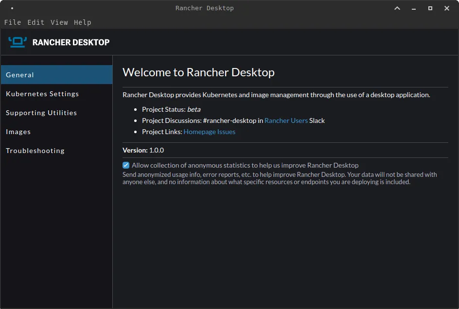
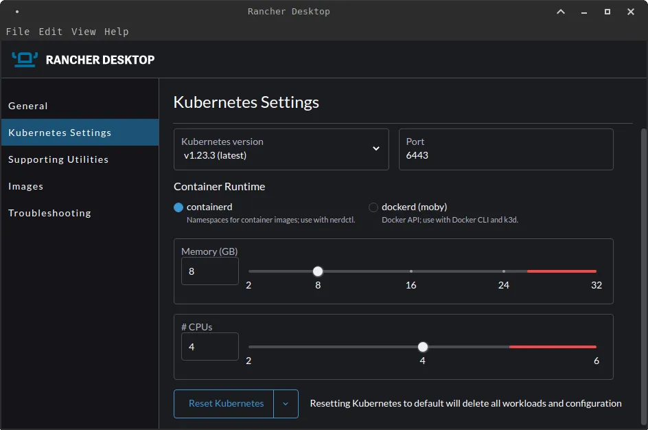
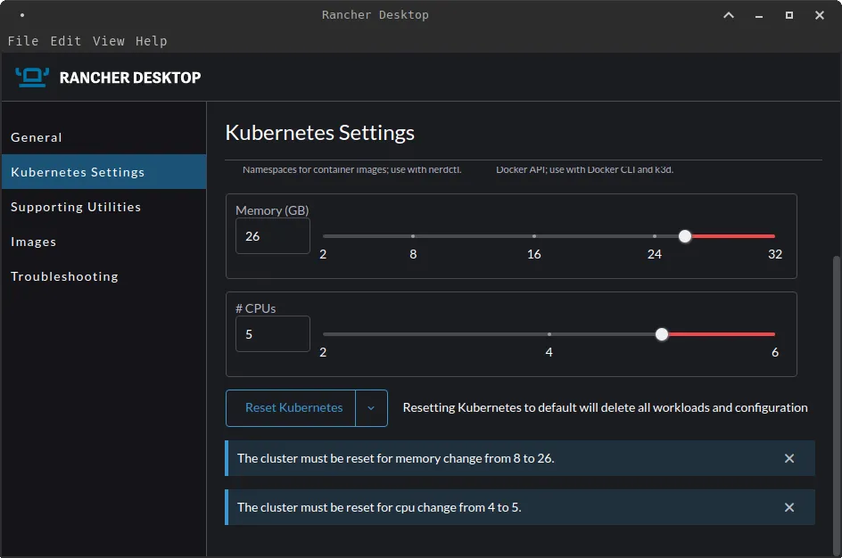
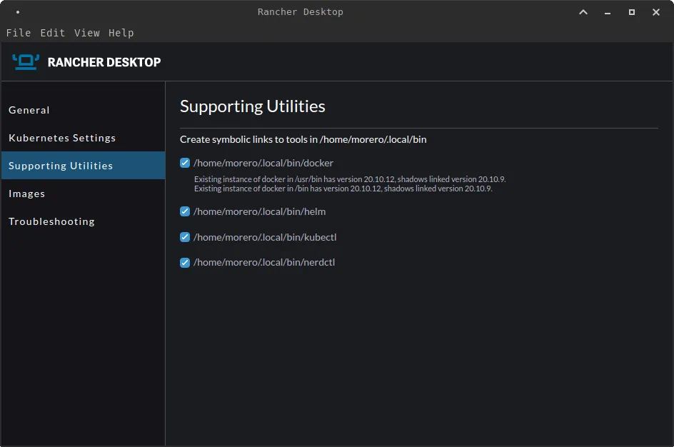
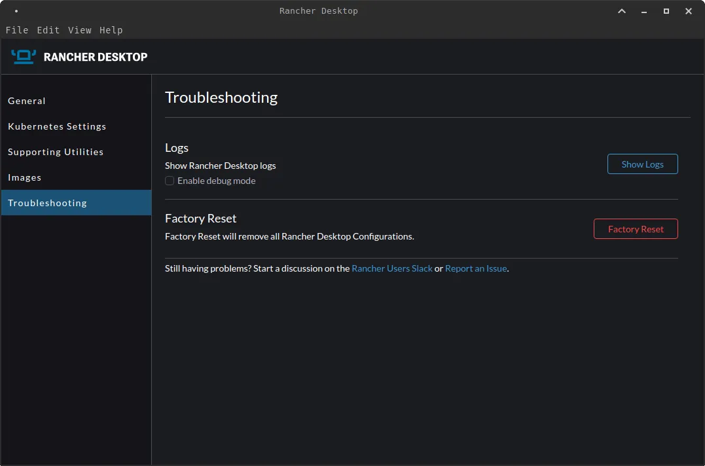
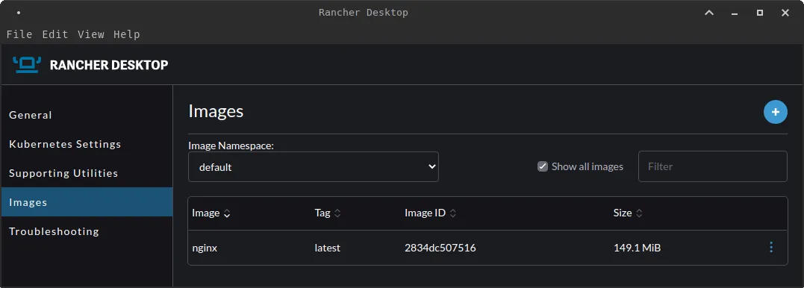
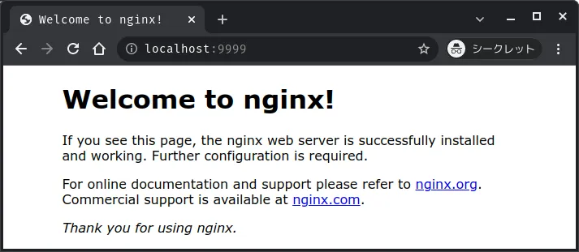
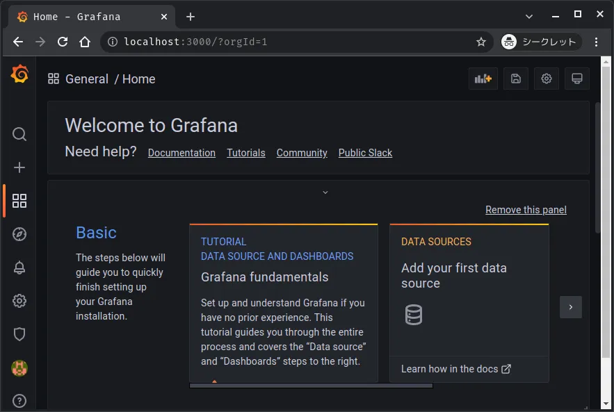

# Running Rancher Desktop on MXLinux


On January 26th, [Rancher Desktop](https://rancherdesktop.io/) was officially released as [v1.0.0](https://github.com/rancher-sandbox/rancher-desktop/releases/tag/v1.0.0).

In this article, I'll try to install and run Rancher Desktop on MXLinux.

<!--more-->

## What is Rancher Desktop?

Rancher Desktop is a desktop application built on Electron and Node.js that allows you to run Kubernetes and container management on your desktop.

You can choose any version of Kubernetes to run.

You can use `containerd` or `Moby (dockerd)` to build, push, pull and run container images. The built container images can be run immediately in Kubernetes without the need for a registry.

## Requirements

It is an OSS desktop application that can run on macOS, Windows, and various Linux environments. It also supports M1, so it can run on almost any environment.

The requirements for each environment are as follows.

### macOS

- **macOS**.
  - Catalina 10.15 or later
- CPU architecture\*\*
  - Intel CPU with Apple Silicon (M1) or VT-x

### WindowsOS

- **Windows**.
  - Windows 10 build 1909 or later
  - Home Edition is also supported
- **Hyper-V (virtualization)** is enabled
- **Windows Subsystem for Linux (WSL)**.
  - Rancher Desktop requires WSL on Windows, but it will be installed automatically as part of the setup
  - No need to download the distribution manually

### Linux

- Distributions that can install `.deb` or `.rpm` packages, or `AppImages

### Machine specs

- 8GB memory
- 4-core CPU

## How it works

Rancher Desktop is wrapping other tools to make it work.

On MacOS and Linux, it leverages virtual machines such as [Lima](https://github.com/lima-vm/lima) and [QEMU](https://www.qemu.org/) to run `containerd` or `dockerd` and Kubernetes ([k3s](https://k3s.io/)).

For Windows systems, we utilize [Windows Subsystem for Linux v2 (WSL2)](https://docs.microsoft.com/en-us/windows/wsl/).

> The figure below is taken from [rancher](https://rancherdesktop.io/)
> how-it-works-rancher-desktop](how-it-works-rancher-desktop.webp)

Rancher Desktop provides functions to build, push, and pull images using [NERDCTL project](https://github.com/containerd/nerdctl) and Docker CLI.
Note that both `nerdctl` and `docker` are automatically included in the path. On Windows, this is done during the installer, and on macOS and Linux, it is done at first run.

To use either of these tools, Rancher Desktop must be running with the appropriate container runtime.

For `nerdctl`, use the `containerd` runtime; for docker, use the `dockerd (moby)` runtime.


**Lima** is similar to WSL, and boots a Linux virtual machine with automatic file sharing and port forwarding, and `containerd`. Lima is intended to be used on macOS hosts, but can be used on Linux hosts as well.



**QEMU** is an OSS PC emulator. It runs on Linux, Windows, etc. on various CPUs such as `x86`, `SPARC`, `MIPS`, etc. It has the feature that it can execute instructions of other CPUs while converting them into native code.



**k3s** is one of the lightweight Kubernetes released by Rancher Labs, featuring a binary size of less than 40MB and a memory usage of only 512MB. Recently, it is expected to be used in IoT and Edge computing.



**nerdctl** is a container manipulation tool for containerd. You can think of it as a docker command for containerd.


## Installing on MXLinux

Let's try to install Rancher Desktop on one of the Linux distributions, [MXLinux](https://mxlinux.org/).

To install, follow the [official documentation](https://docs.rancherdesktop.io/installation#linux), add the Rancher Desktop repository, and install Rancher Desktop.

There are several packages available for installation on Linux, but since MXLinux is based on Debian(stable), we will use the `.deb` package.

```bash
# Obtain and register the repository
$ curl https://download.opensuse.org/repositories/isv:/Rancher:/stable/deb/Release.key | sudo apt-key add -
$ sudo add-apt-repository 'deb https://download.opensuse.org/repositories/isv:/Rancher:/stable/deb/ ./'

# Updated package list
$ sudo apt update

# Install Rancher Desktop
$ sudo apt install rancher-desktop
```

This completes the installation of Rancher Desktop. It's very easy.


MXLinux is one of the most popular Linux distributions on [DistroWatch.com](https://distrowatch.com/).

It is a joint project between antiX and the former MEPIS Linux community and is being developed in Greece and the United States.


## Launching Rancher Desktop

Let's run the installed Rancher Desktop. The application itself is very simple.

### General



### Kubernetes Setting

Next, let's take a look at the Kubernetes configuration.



In `Kubernetes version`, you can specify the version of Kubernetes. You can select from `v1.23.3`, the latest version at the time of writing, to `v1.16.7`, the oldest version.

The `Port` is set to `6443` by default.

For `Container runtime`, you can choose between `containerd` and `dockerd (moby)`.

For `Memory (GB)` and `CPUs`, you can specify the number of memory and CPU cores. If you increase the value up to the red line, a warning message will be displayed as shown below.



If you want to clean up your environment once, you can easily reset it by pressing `Reset Kubernetes`.

### Supporting Utilities

In the `Supporting Utilities` section, you can see the tools that were installed. For Docker, etc., which were already installed, a warning was carefully written.



### Images

In `Images`, you can see the images used by Rancher Desktop. Select `Scan` from `⋮` in the image list to scan the image for vulnerabilities using [Trivy](https://github.com/aquasecurity/trivy).


Notice the `Image Namespace` here. In `containerd`, the concept of `namespace` exists as in Kubernetes.
So, just as Kubernetes can have `namespace`, `containerd` can have `namespace` as well.
In the above figure, the image exists in `namespace:k8s.io`.

Let's check the `namespace` using the `nerdctl` command. Use `nerdctl namespace list` to display a list of `namespaces`.

```bash
$ ./.local/bin/nerdctl namespace list
NAME        CONTAINERS    IMAGES    VOLUMES
buildkit    0             0         0
k8s.io      22            16        0
```

When you run `nerdctl --namespace k8s.io ps`, you can see that the image exists in `k8s.io`.

You can also use `nerdctl --namespace k8s.io ps` to check `namespace:k8s.io` for Kubernetes containers created with Rancher Desktop.

```bash
$ ./.local/bin/nerdctl --namespace k8s.io ps
CONTAINER ID    IMAGE                                               COMMAND                   CREATED           STATUS    PORTS    NAMES
1f642d94e7d5    docker.io/rancher/klipper-lb:v0.3.4                 "entry"                   50 minutes ago    Up                 k8s://kube-system/svclb-traefik-svnfr/lb-port-443
2ca56d5f0874    docker.io/rancher/mirrored-library-traefik:2.5.6    "/entrypoint.sh --gl…"    49 minutes ago    Up                 k8s://kube-system/traefik-6bb96f9bd8-cflf4/traefik
2f1c800451cf    docker.io/rancher/mirrored-coredns-coredns:1.8.6    "/coredns -conf /etc…"    49 minutes ago    Up                 k8s://kube-system/coredns-5789895cd-wgxlq/coredns
56bd8fba2fda    docker.io/rancher/klipper-lb:v0.3.4                 "entry"                   50 minutes ago    Up                 k8s://kube-system/svclb-traefik-svnfr/lb-port-80
5908afd18045    docker.io/rancher/mirrored-pause:3.6                "/pause"                  49 minutes ago    Up                 k8s://kube-system/coredns-5789895cd-wgxlq
8c16131e6d1b    docker.io/rancher/mirrored-pause:3.6                "/pause"                  50 minutes ago    Up                 k8s://kube-system/svclb-traefik-svnfr
95b859fec9ed    docker.io/rancher/mirrored-pause:3.6                "/pause"                  49 minutes ago    Up                 k8s://kube-system/local-path-provisioner-6c79684f77-plbxh
a0656b86ab35    docker.io/rancher/local-path-provisioner:v0.0.21    "local-path-provisio…"    49 minutes ago    Up                 k8s://kube-system/local-path-provisioner-6c79684f77-plbxh/local-path-provisioner
a5c31106d6d7    docker.io/rancher/mirrored-pause:3.6                "/pause"                  49 minutes ago    Up                 k8s://kube-system/traefik-6bb96f9bd8-cflf4
c9417746b27d    docker.io/rancher/mirrored-pause:3.6                "/pause"                  49 minutes ago    Up                 k8s://kube-system/metrics-server-7cd5fcb6b7-4cbkd
ce64e7b0a242    docker.io/rancher/mirrored-metrics-server:v0.5.2    "/metrics-server --c…"    49 minutes ago    Up                 k8s://kube-system/metrics-server-7cd5fcb6b7-4cbkd/metrics-server
```

### Troubleshooting

In `Troubleshooting`, you can enable logging and initialize Rancher Desktop itself.



## 検証

Let's try to run a container on Rancher Desktop.

### Use nerdctl

Try to start nginx using the `nerdctl` command. If `namespace` is not specified, it will be placed in `default` by default.

#### Launch nginx

```bash
$ ./.local/bin/nerdctl run -d -p 9999:80 nginx
docker.io/library/nginx:latest:                                                   resolved       |++++++++++++++++++++++++++++++++++++++|
index-sha256:2834dc507516af02784808c5f48b7cbe38b8ed5d0f4837f16e78d00deb7e7767:    done           |++++++++++++++++++++++++++++++++++++++|
...
elapsed: 7.2 s                                                                    total:  54.1 M (7.5 MiB/s)
484e86556e00843200c97b5aa779ba81a9016796e23964e5a0cac27159de444e
```

#### Check the status of the container.

```bash
$ ./.local/bin/nerdctl ps
CONTAINER ID    IMAGE                             COMMAND                   CREATED          STATUS    PORTS                   NAMES
484e86556e00    docker.io/library/nginx:latest    "/docker-entrypoint.…"    6 minutes ago    Up        0.0.0.0:9999->80/tcp    nginx-484e8
```

#### Check the namespace

```bash
$ ./.local/bin/nerdctl namespace list
NAME      CONTAINERS IMAGES VOLUMES
buildkit  0          0      0
default   1          1      0
k8s.io    22         16     0
```

#### Check the process of namespace default

```bash
$ ./.local/bin/nerdctl --namespace default ps
CONTAINER ID IMAGE COMMAND CREATED STATUS PORTS NAMES
484e86556e00 docker.io/library/nginx:latest "/docker-entrypoint.…" 11 minutes ago Up 0.0.0.0:9999->80/tcp nginx-484e8
```

You can also see the nginx image in `namespace:default` from Rancher Desktop.



Finally, try to access `localhost:9999` to check if nginx is up and running.



### Use Helm

Rancher Desktop also installs Helm at startup, so let's deploy Grafana to Kubernetes using Helm.

#### Add Grafana repository to Helm

```bash
$ ./.local/bin/helm repo add grafana https://grafana.github.io/helm-charts
```

#### Verify that the repository has been added to Helm

```bash
$ ./.local/bin/helm repo list
NAME    URL
grafana https://grafana.github.io/helm-charts
```

#### View the chart from the added Grafana repository

```bash
$ ./.local/bin/helm search repo grafana
NAME                            CHART VERSION   APP VERSION DESCRIPTION
grafana/grafana                 6.21.1          8.3.4       The leading tool for querying and visualizing t...
grafana/grafana-agent-operator  0.1.5           0.22.0      A Helm chart for Grafana Agent Operator
grafana/enterprise-logs         2.0.0           v1.3.0      Grafana Enterprise Logs
grafana/enterprise-metrics      1.7.3           v1.6.1      Grafana Enterprise Metrics
grafana/fluent-bit              2.3.0           v2.1.0      Uses fluent-bit Loki go plugin for gathering lo...
grafana/loki                    2.9.1           v2.4.2      Loki: like Prometheus, but for logs.
grafana/loki-canary             0.5.1           2.4.1       Helm chart for Grafana Loki Canary
grafana/loki-distributed        0.42.0          2.4.2       Helm chart for Grafana Loki in microservices mode
grafana/loki-simple-scalable    0.2.0           2.4.2       Helm chart for Grafana Loki in simple, scalable...
grafana/loki-stack              2.5.1           v2.1.0      Loki: like Prometheus, but for logs.
grafana/promtail                3.10.0          2.4.2       Promtail is an agent which ships the contents o...
grafana/tempo                   0.13.0          1.3.0       Grafana Tempo Single Binary Mode
grafana/tempo-distributed       0.15.0          1.3.0       Grafana Tempo in MicroService mode
grafana/tempo-vulture           0.2.0           1.3.0       Grafana Tempo Vulture - A tool to monitor Tempo...
```

#### Helm Charts Released

```bash
$ ./.local/bin/kubectl create namespace monitoring
$ ./.local/bin/helm install grafana --namespace monitoring grafana/grafana
W0128 03:37:33.477723  218028 warnings.go:70] policy/v1beta1 PodSecurityPolicy is deprecated in v1.21+, unavailable in v1.25+
W0128 03:37:33.480386  218028 warnings.go:70] policy/v1beta1 PodSecurityPolicy is deprecated in v1.21+, unavailable in v1.25+
W0128 03:37:33.538004  218028 warnings.go:70] policy/v1beta1 PodSecurityPolicy is deprecated in v1.21+, unavailable in v1.25+
W0128 03:37:33.538201  218028 warnings.go:70] policy/v1beta1 PodSecurityPolicy is deprecated in v1.21+, unavailable in v1.25+
NAME: grafana
LAST DEPLOYED: Fri Jan 28 03:37:32 2022
NAMESPACE: monitoring
STATUS: deployed
REVISION: 1
NOTES:
1. Get your 'admin' user password by running:

   kubectl get secret --namespace monitoring grafana -o jsonpath="{.data.admin-password}" | base64 --decode ; echo

2. The Grafana server can be accessed via port 80 on the following DNS name from within your cluster:

   grafana.monitoring.svc.cluster.local

   Get the Grafana URL to visit by running these commands in the same shell:

     export POD_NAME=$(kubectl get pods --namespace monitoring -l "app.kubernetes.io/name=grafana,app.kubernetes.io/instance=grafana" -o jsonpath="{.items[0].metadata.name}")
     kubectl --namespace monitoring port-forward $POD_NAME 3000

3. Login with the password from step 1 and the username: admin
#################################################################################
######   WARNING: Persistence is disabled!!! You will lose your data when   #####
######            the Grafana pod is terminated.                            #####
#################################################################################
```

Following the steps above, you should now be able to successfully login to Grafana.



Finally, use the `kubectl` command to make sure that Grafana is up and running.

```bash
$ ./.local/bin/kubectl get all --namespace monitoring
NAME                           READY   STATUS    RESTARTS   AGE
pod/grafana-6b9d4f7f86-mwb4q   1/1     Running   0          15m

NAME              TYPE        CLUSTER-IP     EXTERNAL-IP   PORT(S)   AGE
service/grafana   ClusterIP   10.43.218.65   <none>        80/TCP    15m

NAME                      READY   UP-TO-DATE   AVAILABLE   AGE
deployment.apps/grafana   1/1     1            1           15m

NAME                                 DESIRED   CURRENT   READY   AGE
replicaset.apps/grafana-6b9d4f7f86   1         1         1       15m
```

As you can see above, you can easily develop and deploy your application just by running Rancher Desktop.

## Impression

This time, I touched Rancher Desktop, which was released v1.0.0, and found it to be a very complete tool. If you are new to `containerd` or `nerdctl`, Rancher Desktop is a good opportunity for you.

Last year, [Docker Desktop is now paid](https://www.docker.com/blog/updating-product-subscriptions/) became a big news, and Rancher Desktop, but
If you switch from Docker Desktop, you will be able to use it without any problems. If you want to use Docker's runtime, you can switch from Rancher Desktop without much trouble.

Also, I personally think that the ability to smoothly switch between Kubernetes versions is a big advantage.

There is a great possibility that this will become one of the most popular ways to use containers in the future, so I will keep an eye on the future developments.

