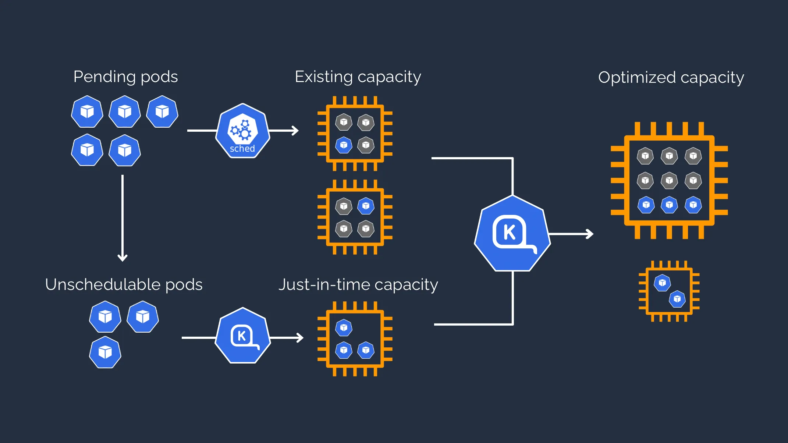

# Karpenter Deep Dive


Recently, Karpenter graduated from AWS re:Invent with autoscaling of Nodes in Kubernetes clusters.

In this article, we'll take a deeper look at it.

<!--more-->

## Introduction

This is the 18th day of the [Kubernetes Advent Calendar 2021](<(https://qiita.com/advent-calendar/2021/kubernetes)).

## What is Karpenter?

Officially described as "Just-in-time Nodes for Any Kubernetes Cluster", Karpenter provides the ability to instantly provision new Nodes for unscheduled Pods. The goal is to improve the efficiency and cost of running workloads on Kubernetes clusters.

Karpenter works as follows.

- Monitor Pods that the Kubernetes scheduler has marked as unschedulable
- Evaluate the following scheduling constraints as requested by the Pod
  - Resource Request
  - Node Selector
  - Affinity
  - Tolerant
  - Topology spreading constraints
- Provisioning a Node to meet Pod requirements
- Scheduling a Pod to run on a new Node
- Deleting a Node when it is no longer needed


Karpenter will only support AWS as of December 2021.


## Autoscale in Kubernetes

### Pod

There are two ways to scale the Pod.

#### Horizontal Pod Auto scaler

Horizontal pod scaling is a method of scaling to improve processing performance by increasing the number of pods. User-defined metrics such as CPU, memory, etc. can also be used to make decisions.

The number of pods is calculated by the following formula.


\[希望するレプリカ数 = \lceil {現在の Pod 数 \times \frac{現在の指標値}{ターゲットとする指標値}} \rceil\]


#### Vertical Pod Auto scaler

This is a method of scaling that improves processing performance by increasing the resources available to the pod. In this case, the CPU and memory are used as criteria. It is more like optimizing the resource utilization.

### Node

#### Cluster Auto scaler

It is a method of scaling to improve processing performance by increasing the number of worker Nodes. It can also be used in conjunction with horizontal scaling of Pods.

## How to install

Karpenter will be installed on the cluster with Helm Chart.
Karpenter also requires IAM Roles for Service Accounts (IRSA).

Currently, the utilities required to use Karpenter are as follows

- [AWS CLI](https://docs.aws.amazon.com/cli/latest/userguide/cli-chap-getting-started.html)
- `kubectl`
  - [the Kubernetes CLI](https://kubernetes.io/docs/tasks/tools/install-kubectl-linux/)
- `eksctl`
  - [the CLI for AWS EKS](https://docs.aws.amazon.com/eks/latest/userguide/eksctl.html)
- `helm`
  - [the package manager for Kubernetes](https://karpenter.sh/docs/getting-started/#install)

To learn how to install Karpenter on AWS, please refer to the official document "[Getting Started with Karpenter on AWS](https://karpenter.sh/docs/getting-started/#install)".

Karpenter's Helm Chart can be found [here](https://github.com/aws/karpenter/tree/main/charts/karpenter).


Kapenter also provides an installation method using [Terraform](https://learn.hashicorp.com/tutorials/terraform/install-cli). See [here](https://karpenter.sh/docs/getting-started-with-terraform/) for details.


An overview diagram is shown in the figure below.



## Configure the provisioner

Karpenter's job is to add Nodes that handle non-schedulable Pods, schedule Pods on those Nodes, and remove the Nodes when they are no longer needed.

To configure Karpenter, create a provisioner that defines how Karpenter will manage non-schedulable Pods and timed Nodes.

The following is what you need to know about Karpenter provisioners.

### Unschedulable pods

Karpenter will only attempt to provision Pods with the status condition `Unschedulable=True`. This will be set when the kube-scheduler fails to schedule a Pod to an existing capacity.

### Provisioner CR

Karpenter defines a custom resource called `Provisioner` to specify the provisioning configuration.

Each provisioner manages a separate set of Nodes, but a Pod can be scheduled to any provisioner that supports its scheduling constraints.

A provisioner contains constraints that affect the Nodes that can be provisioned and the attributes of the Nodes (such as timers for removing Nodes).

The following are the resources of the provisioner.

```yaml
apiVersion: karpenter.sh/v1alpha5
kind: Provisioner
metadata:
  name: default
spec:
  ttlSecondsUntilExpired: 2592000
  ttlSecondsAfterEmpty: 30
  taints:
    - key: example.com/special-taint
      effect: NoSchedule
  labels:
    billing-team: my-team
  requirements:
    - key: "node.kubernetes.io/instance-type"
      operator: In
      values: ["m5.large", "m5.2xlarge"]
    - key: "topology.kubernetes.io/zone"
      operator: In
      values: ["us-west-2a", "us-west-2b"]
    - key: "kubernetes.io/arch"
      operator: In
      values: ["arm64", "amd64"]
    - key: "karpenter.sh/capacity-type"
      operator: In
      values: ["spot", "on-demand"]
  provider: {}
```

The `spec.ttlSecondsUntilExpired` is the number of seconds the controller will wait before exiting the Node, measured from the time the Node is created. This is useful to eventually implement features like consistent Node upgrades, memory leak protection, and destructive testing. If this field is not set, termination due to expiration will be disabled.

The `spec.ttlSecondsAfterEmpty` is the number of seconds the controller will wait between the time it detects that a Node is empty and the time it tries to remove the Node. A Node is considered empty if there are no Pods scheduled for that Node, except for the daemonset.

The `spec.requirements` constrains the parameters of the provisioned Node. It can be combined with `nodeAffinity` and `nodeSelector`. The `{ In, NotIn }` operator is supported to include or exclude values.

## Deprovisioning Node

Karpenter deletes the nodes that are no longer needed as follows.

### Finalizer

Karpenter will place a finalizer bit in each Node it creates.

When a request to delete these Nodes comes in (such as a TTL or manual Node deletion via kubectl), Karpenter codes the Node, ejects all Pods, terminates the EC2 instance, and deletes the Node object.

Karpenter handles all the cleanup work required to properly delete the Node.

### Node Expiry

When a Node reaches its expiration value (`ttlSecondsUntilExpired`), it will be ejected and removed from the Pod (even if it is still running a workload).

### Empty Nodes

When the last workload Pod running on a Karpenter-managed Node runs out, that Node will be given an `emptiness` timestamp. When its "Node is empty" expiration date (`ttlSecondsAfterEmpty`) is reached, finalization is triggered.


For more information on how Karpenter deletes Nodes, see [Details](https://karpenter.sh/docs/tasks/deprov-nodes/) on Node deprovisioning.


## Upgrade Node

An easy way to upgrade a Node is to set `ttlSecondsUntilExpired`, which will expire after a set period of time and be replaced by a newer Node.

## Constraints

Because there are no constraints defined by the provisioner or requested by the Pod being deployed, Karpenter is selected from the entire set of features available from the cloud provider. Nodes can be created using any instance type and run in any zone.

## Scheduling

Karpenter schedules Pods that are marked as `unschedulable` by the Kubernetes scheduler. After resolving scheduling constraints and startup capacity, it creates a Node and binds the Pod. This stateless approach will help you avoid race conditions and improve performance. If there is a problem with a launched Node, Kubernetes will automatically migrate the Pod to a new Node. When Karpenter launches a Node, it will also allow Kubernetes' scheduler to schedule on it.

## Cloud provider

Karpenter makes a request to the relevant cloud provider for provisioning a new Node. The first supported cloud provider is AWS, but Karpenter is designed to work with other cloud providers as well. While using the well-known labels of Kubernetes, the provisioner can set a number of values specific to the cloud provider.

If you are developing your own provider, you can create it in the repository under `pkg/cloudprovider/`. The directory structure is as follows. The `fake` directory is provided as an example for reference.

```bash
.
├── aws
│   ├── apis
│   │   └── v1alpha1
│   └── fake
├── fake
├── metrics
└── registry
```

First, you need to create the following files for each cloud provider under `pkg/cloudprovider/registry` to register them.

```golang
// +build <YOUR_PROVIDER_NAME>
import (
    "github.com/aws/karpenter/pkg/cloudprovider/<YOUR_PROVIDER_NAME>"
)

func NewCloudProvider() cloudprovider.CloudProvider {
    return <YOUR_PROVIDER_NAME>.NewCloudProvider()
}
```

You can also create one for each cloud provider under `pkg/cloudprovider` for your environment. If you check the `fake` directory, you will find the following files. You can add other necessary information according to your environment.

```bash
.
├── cloudprovider.go
└── instancetype.go
```

## Difference from Cluster Auto scaler

Like Karpenter, the Kubernetes Cluster Auto scaler is designed to add Nodes when a request comes in to run a Pod that cannot be handled by the current capacity.
Cluster Auto scaler is part of the Kubernetes project and is implemented by most of the major Kubernetes cloud providers. By rethinking provisioning, Karpenter provides the following improvements.

### Designed to take advantage of the flexibility of the cloud

Karpenter has the ability to efficiently handle any type of instance available in AWS. Cluster Autoscaler was not originally built with the flexibility to support hundreds of instance types, zones, and purchase options.

### Group less Node Provisioning

Karpenter manages each instance directly, without orchestration mechanisms such as Node groups. This allows you to retry in milliseconds instead of minutes if capacity is not available. It also allows you to take advantage of a variety of instance types, availability zones, and purchasing options without having to create hundreds of Node groups.

### Scheduling Implementation

Cluster Autoscaler does not bind a Pod to the Node it creates. Instead, it relies on the `kube-scheduler` to make the same scheduling decision after the Node comes online. The Node started by Karpenter is bound to its Pod immediately. kubelet` does not need to wait for the scheduler or Node to be ready. kubelet` does not need to wait for the scheduler or Node to be ready, it can start preparing the container runtime immediately, including pre-pulling images. This can reduce the Node startup latency by a few seconds.

## Thoughts

In this article, I've tried to dig a little deeper into Karpenter.

Personally, I think it's the same as GKE Autopilot's dynamic Node provisioning process. I think Karpenter is an OSS version of that tool. Like GKE Autopilot, Karpenter observes the specification of non-schedulable pods, computes aggregate resource requests, and sends the requests to an underlying compute service (such as Amazon EC2) that has the capacity required to run all the pods.

Karpenter also allows you to define custom resources and specify the provisioning configuration for the following Nodes. We found the flexibility to change the configuration to be a significant advantage.

- Instance size/type, topology (zone, etc.)
- Architecture (arm64, amd64, etc.)
- Lifecycle type (spot, on-demand, pre-emptive, etc.)

On the other hand, Karpenter can also deprovision a Node when it is no longer needed. This can be determined by setting the Node's expiration date (`ttlSecondsUntilExpired`) or when the last workload running on a Karpenter provisioned Node has finished (`ttlSecondsAfterEmpty`). Either of these two events triggers a finalization that codes the Node, ejects the Pod, terminates the underlying compute resource, and deletes the Node object. This deprovisioning feature can also be used to keep Node up-to-date with the latest AMI.

With Karpenter, I believe you can offload Node provisioning, autoscaling and upgrading and focus on running your application. Karpenter works with all kinds of Kubernetes applications, but I think it performs especially well in use cases where large amounts of diverse compute resources need to be provisioned and de-provisioned quickly. (Training machine learning models, running simulations, batch jobs with complex financial calculations, etc.)

Currently, it only runs on AWS, but we will keep an eye on it in the future. If I have time, I'll try to implement it on other clouds as well.

