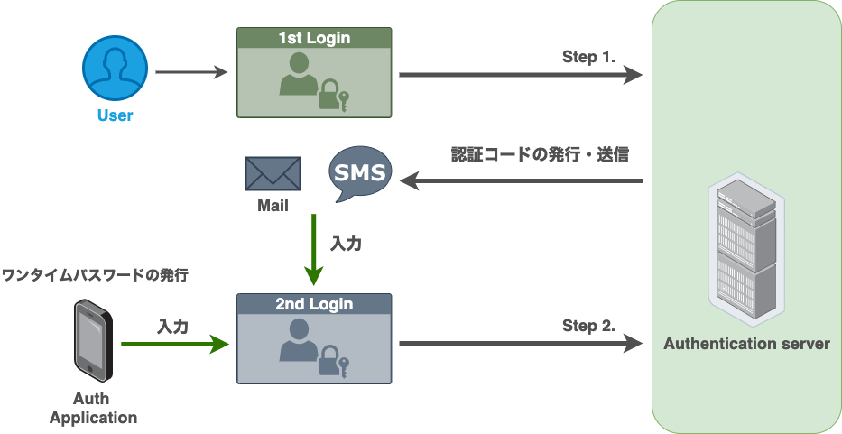
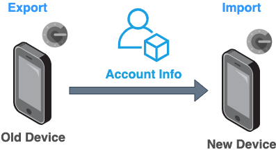

# Google Authenticator からの引き継ぎ方法

Google Authenticator の機種変更時の引き継ぎ方法について説明します.

また、個人的に推奨している Microsoft Authenticator についても解説します.

<!--more-->

## 概要

近年、セキュリティの強化として**2 段階認証の導入**が推奨され、多くの方が SMS 認証や Google Authenticator などの認証アプリケーションをスマートフォンなどにインストールしているかと思います.

しかし、認証アプリは機種変更などをした際に正しい引き継ぎ手順を踏まなければ、認証アプリにログインできなくなります.それによって苦汁を舐めた人たちも多くいるのではないでしょうか.

そのような事態にならないためにも、正しい手順を理解し、スムーズに引き継げるようにしましょう.

## そもそも 2 段階認証って？

2 段階認証はその名の通り、「**2 度の認証を行う**」ことです. 従来の 1 つの認証方法を使うよりはるかにセキュアに管理する事ができます.

2 段階認証には、様々な方法があります.

### SMS, メールなどを用いる場合

認証サーバなどで特定の文字列などが発行され、送信されます. ユーザはそれを画面上で入力します.

### 2 段階認証アプリケーションを用いる場合

アプリケーション上でワンタイムのセキュリティコードが自動的に生成され、そのコードを画面上に入力します.


2 段階認証アプリは別名、**TOTP (Time-based One-Time Password)** アプリとも呼ばれます


## 2 段階認証を扱う上での注意点

いくらセキュアな機能だとしても注意するべき点はいくつかあります.

2 段階目の認証として最も利用されているのはスマートフォンだと思います. スマートフォンの電話番号宛に SMS が届き、そのコードを利用したり、キャリアメールアドレスに送られるコードを利用したりするため、スマートフォンの紛失・盗難時にログインできなくなります.

これは、ワンタイムパスワードを用いる場合も同じことが言えます. Google Authenticator を利用している場合は、スマートフォンにインストールして利用しているため、紛失・盗難時には同じくログインすることができません.

また、スマートフォンの機種を変更した場合も引き継ぎを正しく行っていなければアプリケーションをインストールしても復元することができません.

これらを回避する方法としては以下の通りです.

- **複数の認証方法を設定しておく**
  - SMS + 2 段階認証アプリケーション
  - 2 段階認証アプリケーション + メール
  - etc...
- **引き継ぎの際、2 段階認証の設定を無効化(解除)しておく**

## 引き継ぎ方法 (Google Authenticator)

Google Authenticator を新しいデバイスへ引き継ぐ方法について解説します.

以前までは、アプリケーションに登録している 2 段階認証を全て無効化する必要がありましたが、現在は引き継ぐ前のデバイスでアカウント情報をエクスポートし、
それを新しいデバイスでインポートすることでアカウントを移行することができます.

それぞれのデバイスでの手順は以下の通りです.

### iOS

- 移行前のデバイス

  1. Google Authenticator を起動
  2. 起動したアプリケーションの右上のメニューボタン`...`をタップし、「**アカウントのエクスポート**」を選択
  3. エクスポート画面で、右下「**続行**」ボタンをタップ
  4. 指紋認証、FaceID、または端末に設定している PIN（パスコード）を入力して本人確認を実行
  5. 移行させるアカウントを選択して、「**エクスポート**」をタップ
  6. 移行用 QR コードが表示されたら準備完了

- 新しいデバイス
  1. Google Authenticator を起動し、「**開始**」をタップ
  2. 左下「**既存のアカウントをインポートしますか？**」をタップ
  3. 右下「**QR コードをスキャン**」をタップ
  4. エクスポート時に作成した移行用 QR コードを読み込む

### Android

- 移行前のデバイス

  1. Google Authenticator を起動
  2. 起動したアプリケーションの右上のメニューボタン`...`をタップし、「**アカウントの移行**」を選択
  3. エクスポート画面で、右下「**アカウントのエクスポート**」ボタンをタップ
  4. 本人確認を実行
  5. 「**次へ**」をタップ
  6. 移行用 QR コードが表示されたら準備完了

- 新しいデバイス
  1. Google Authenticator を起動し、「**使ってみる**」をタップ
  2. 左下「**既存のアカウントをインポートしますか？**」をタップ
  3. 右下「**QR コードをスキャン**」をタップ
  4. エクスポート時に作成した移行用 QR コードを読み込む

上記の手順を実行後、「**インポート完了**」と表示されれば引き継ぎは完了です.

## Microsoft Authenticator の利用

上記では Google Authenticator を解説しましたが、私は**Microsoft Authenticator**を使用しています.

理由としては以下の通りです.

- バックアップ機能が搭載されていない
- 登録されているアプリケーションを並び替えると UI が壊れる
  - 同一アプリケーションが複数表示される (誤って消すと両方とも消える)
- スマートフォン・アプリケーションでしか利用できない

非常にシンプルなのですが、UI が壊れるのも耐え難く、最大の理由としては「**バックアップ機能が搭載されていない**」という点です. 万が一、デバイスが起動しなくなった際の再設定などの手間を考えると、あまり使いやすいとは言えません.

一方で、Microsoft Authenticator だと、Microsoft アカウントをアプリと同期することでバックアップが可能です. 詳しい方法に関しては、[こちら](https://support.microsoft.com/ja-jp/account-billing/%E3%82%A2%E3%83%97%E3%83%AA%E3%81%A7%E3%82%A2%E3%82%AB%E3%82%A6%E3%83%B3%E3%83%88%E8%B3%87%E6%A0%BC%E6%83%85%E5%A0%B1%E3%82%92%E3%83%90%E3%83%83%E3%82%AF%E3%82%A2%E3%83%83%E3%83%97%E3%81%8A%E3%82%88%E3%81%B3authenticator%E3%81%99%E3%82%8B-bb939936-7a8d-4e88-bc43-49bc1a700a40)を参照ください.


**iOS 版では iCloud でバックアップを行うため、iCloud のアカウントが必要となります.**


しかし、Microsoft Authenticator も Google Authenticator と同じく、スマートフォン・アプリケーションでしか利用できません. 「PC でも使用したい！」と言う方は、[Twilio](https://www.twilio.com/ja/)社の`Authy`を使用することをおすすめします.


**Authy を利用する場合は、別途 Authy のアカウントを作成する必要があります.**


## まとめ

今回は、2 段階認証の仕組みと、認証アプリケーションの引き継ぎ方法などについて解説しました.

2 段階認証アプリケーションを使用することで、アカウントの情報をよりセキュアに管理することができる反面、きちんと管理する必要があります. 特に 2 段階認証設定後の**バックアップコード**の管理には十分、注意してください.

実体が無いとは言え、重要な資産なので、この記事を参考に大切に保管しましょう.

