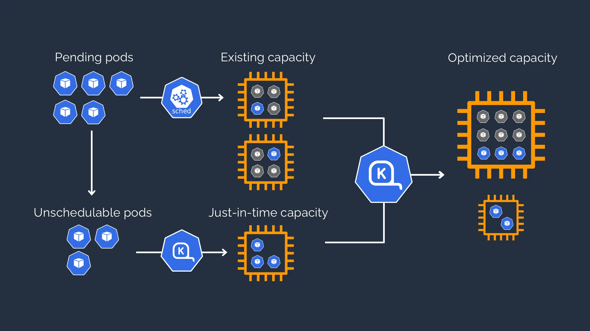

# Karpenter Deep Dive


先日、AWS re:Invent にて Kubernetes クラスターで Node の自動スケーリングをする [Karpenter](https://karpenter.sh/) が GA になりました.

今回は、それについて深堀りしてみます.

<!--more-->

## はじめに

これは [Kubernetes Advent Calendar 2021](https://qiita.com/advent-calendar/2021/kubernetes) 18 日目の記事です.

## Karpenter とは

[Karpenter](https://karpenter.sh/) は、**「Just-in-time Nodes for Any Kubernetes Cluster」** と公式で記載されている通り、スケジュールが不能な Pod に対して、瞬時に新しい Node をプロビジョニングする機能を提供します. それにより、Kubernetes クラスター上でワークロードを実行する際の効率とコスト改善をゴールとしています.

Karpenter の動作は以下の通りになります.

- Kubernetes スケジューラがスケジューリング不能とマークした Pod を監視する
- Pod から要求された以下のスケジューリング制約の評価
  - リソース要求
  - Node セレクタ
  - アフィニティ
  - トレラント
  - トポロジー拡散制約
- Pod の要件を満たす Node のプロビジョニング
- 新しい Node で実行する Pod のスケジューリング
- Node が不要になったら削除する


Karpenter は 2021 年 12 月 現在、AWS のみをサポートしています.


## Kubernetes におけるオートスケール

Kubernetes には、Pod と Node それぞれにオートスケールする機能が提供されています.

### Pod

Pod には、以下の 2 種類のスケール方法があります.

#### 水平スケール (Horizontal Pod Autoscaler)

Pod の水平スケールは、Pod 数を増やすことにより処理性能を向上させるスケール方法です. CPU やメモリなど、ユーザが独自に設定したメトリクスなども判断の材料として使えます.

Pod 数は以下の計算式で算出されます.


\[希望するレプリカ数 = \lceil {現在の Pod 数 \times \frac{現在の指標値}{ターゲットとする指標値}} \rceil\]


#### 垂直スケール (Vertical Pod Autoscaler)

Pod が利用可能なリソースを増やすことで処理性能を向上させるスケール方法です. こちらは、CPU やメモリを判断材料に使用します. どちらかと言うとリソース使用率の最適化を行っているイメージです.

### Node

#### Node の水平オートスケーラー (Cluster Autoscaler)

ワーカー Node の台数を増やすことによって処理性能を向上させるスケール方法です. Pod の水平スケールなどと連携することも可能です.

## インストール方法

Karpenter は、Helm Chart でクラスタにインストールされます.
Karpenter はさらに、IAM Roles for Service Accounts (IRSA)を必要とします.

現在、Karpenter を使用する際に必要なユーティリティは以下の通りです.

- [AWS CLI](https://docs.aws.amazon.com/cli/latest/userguide/cli-chap-getting-started.html)
- `kubectl`
  - [the Kubernetes CLI](https://kubernetes.io/docs/tasks/tools/install-kubectl-linux/)
- `eksctl`
  - [the CLI for AWS EKS](https://docs.aws.amazon.com/eks/latest/userguide/eksctl.html)
- `helm`
  - [the package manager for Kubernetes](https://karpenter.sh/docs/getting-started/#install)

AWS への Karpenter のインストール方法は、[こちら](https://karpenter.sh/docs/getting-started/#install)の公式ドキュメントの **「Getting Started with Karpenter on AWS」** を参考にすると良いと思います.

Karpenter の Helm Chart は[こちら](https://github.com/aws/karpenter/tree/main/charts/karpenter)から確認することができます.


[Terraform](https://learn.hashicorp.com/tutorials/terraform/install-cli) を使用したインストール方法もあります.詳しくは[こちら](https://karpenter.sh/docs/getting-started-with-terraform/)を参照してください.


概要図は下図の通りです。



## プロビジョナーの設定

Karpenter の仕事は、スケジュールできない Pod を処理する Node を追加し、その Node で Pod をスケジュールし、不要になったら Node を削除することです.

Karpenter を設定するには、Karpenter がスケジューリング不能な Pod と期限付き Node を管理する方法を定義するプロビジョナーを作成します.

以下は、Karpenter のプロビジョナーについて知っておくと良いと思います.

### Unschedulable pods

Karpenter は、ステータス条件 `Unschedulable=True` を持つ Pod のみをプロビジョニングしようとします. これは、kube-scheduler が既存の容量に Pod をスケジュールすることに失敗したときに設定されます.

### Provisioner CR

Karpenter では、プロビジョニング構成を指定するために、`Provisioner` というカスタムリソースを定義しています.

各プロビジョナーは個別の Node セットを管理しますが、Pod はそのスケジューリング制約をサポートする任意のプロビジョナーにスケジュールすることができます.

プロビジョナーには、プロビジョニング可能な Node と Node の属性（Node を削除するためのタイマーなど）に影響を与える制約が含まれています.

以下が プロビジョナーのリソースになります.

```yaml
apiVersion: karpenter.sh/v1alpha5
kind: Provisioner
metadata:
  name: default
spec:
  ttlSecondsUntilExpired: 2592000
  ttlSecondsAfterEmpty: 30
  taints:
    - key: example.com/special-taint
      effect: NoSchedule
  labels:
    billing-team: my-team
  requirements:
    - key: "node.kubernetes.io/instance-type"
      operator: In
      values: ["m5.large", "m5.2xlarge"]
    - key: "topology.kubernetes.io/zone"
      operator: In
      values: ["us-west-2a", "us-west-2b"]
    - key: "kubernetes.io/arch"
      operator: In
      values: ["arm64", "amd64"]
    - key: "karpenter.sh/capacity-type"
      operator: In
      values: ["spot", "on-demand"]
  provider: {}
```

`spec.ttlSecondsUntilExpired`は、コントローラが Node を終了するまでに待つ秒数で、Node の作成時から計測されます. これは、最終的に一貫した Node アップグレード、メモリリーク保護、破壊テストのような機能を実装するのに便利です. このフィールドが設定されていない場合、有効期限切れによる終了は無効になります.

`spec.ttlSecondsAfterEmpty`は、Node が空になったことを検出した時点から、コントローラが Node を削除しようとするまでに待つ秒数です. Node は、デーモンセットを除いて、その Node にスケジュールされている Pod がない場合、空であると見なされます.

`spec.requirements`は、プロビジョニングされた Node のパラメータを制約します. `nodeAffinity` や `nodeSelector` と組み合わせることも可能です. 演算子 `{ In, NotIn }` は、値を含めたり除外したりするためにサポートされています.

## Node のデプロビジョニング

Karpenter では、不要になった Node を以下のように削除しています.

### Finalizer

Karpenter は、作成する各 Node にファイナライザービットを配置します。

これらの Node を削除するリクエスト（TTL や手動での kubectl による Node 削除など）が来ると、Karpenter は Node をコード化し、すべての Pod を排出して EC2 インスタンスを終了させ、Node オブジェクトを削除する.

Karpenter は、Node を適切に削除するために必要なすべてのクリーンアップ作業を処理します.

### Node Expiry

Node の有効期限値 (`ttlSecondsUntilExpired`)に達すると、その Node は（まだワークロードを実行していても）Pod から排出され、削除されます.

### Empty Nodes

Karpenter が管理する Node で稼働している最後のワークロード Pod がなくなると、その Node には `emptiness` タイムスタンプが付与されます。その「Node が空になる」有効期限 (`ttlSecondsAfterEmpty`) 達すると、ファイナライズがトリガーされます.


Karpenter が Node を削除する方法の詳細については、Node のデプロビジョニングの[詳細](https://karpenter.sh/docs/tasks/deprov-nodes/)を参照してください.


## Node のアップグレード

Node をアップグレードする簡単な方法は、`ttlSecondsUntilExpired` を設定することです。Node は設定された期間後に終了し、より新しい Node と入れ替わります.

## 制約条件

プロビジョナーで定義された制約や、デプロイされる Pod から要求された制約がないため、Karpenter はクラウドプロバイダが利用できる機能全体から選択されます. Node は、任意のインスタンスタイプを使用して作成し、任意のゾーンで実行することができます.

## スケジューリング

Karpenter は、Kubernetes のスケジューラーが `unschedulable` とマークした Pod をスケジュールします. スケジューリング制約と起動容量を解決した後、Node を作成し、Pod をバインドします. このステートレスなアプローチは、レースコンディションを回避し、パフォーマンスを向上させるのに役立ちます. 起動した Node に何か問題があれば、Kubernetes は自動的に新しい Node に Pod を移行します. Karpenter が Node を立ち上げると、その Node は Kubernetes のスケジューラーがその上でをスケジュールすることも可能になります.

## クラウドプロバイダー

Karpenter は、関連するクラウドプロバイダーに新しい Node のプロビジョニングの要求を行います. 最初にサポートされるクラウドプロバイダーは AWS ですが、Karpenter は他のクラウドプロバイダーでも動作するように設計されています. Kubernetes のよく知られたラベルを使用しながら、プロビジョナーは、クラウドプロバイダーに固有のいくつかの値を設定することができます.

個人でプロバイダーの開発する場合は、リポジトリの`pkg/cloudprovider/`配下に作成します. ディレクトリ構造は以下の通りです. `fake`ディレクトリは、参考例として用意されています.

```bash
.
├── aws
│   ├── apis
│   │   └── v1alpha1
│   └── fake
├── fake
├── metrics
└── registry
```

まず、`pkg/cloudprovider/registry`配下で、クラウドプロバイダー毎に以下の以下のファイルを作成することで登録ができます.

```golang
// +build <YOUR_PROVIDER_NAME>
import (
    "github.com/aws/karpenter/pkg/cloudprovider/<YOUR_PROVIDER_NAME>"
)

func NewCloudProvider() cloudprovider.CloudProvider {
    return <YOUR_PROVIDER_NAME>.NewCloudProvider()
}
```

また、`pkg/cloudprovider`配下で、クラウドプロバイダーごとに環境に合わせて作成します. `fake` ディレクトリを確認すると以下のファイルが用意されています. その他の必要な情報は環境に合わせて追加すると良いです.

```bash
.
├── cloudprovider.go
└── instancetype.go
```

## Cluster Autoscaler との違い

Karpenter と同様に、Kubernetes Cluster Autoscaler は、現在のキャパシティでは対応できない Pod の実行要求が来たときに、Node を追加するように設計されています.
Cluster Autoscaler は Kubernetes プロジェクトの一部であり、ほとんどの主要な Kubernetes クラウドプロバイダーが実装しています. プロビジョニングを見直すことで、Karpenter は以下の改善を提供しています.

### クラウドの柔軟性を活かした設計

Karpenter は、AWS で利用できるあらゆる種類のインスタンスに効率的に対応できる能力を備えています. Cluster Autoscaler は、もともと何百ものインスタンスタイプ、ゾーン、購入オプションに対応できるような柔軟性を持って構築されたものではありません.

### グループレスの Node プロビジョニング

Karpenter は、Node グループのようなオーケストレーションの仕組みを使わずに、各インスタンスを直接管理します. これにより、キャパシティが利用できない場合、数分ではなくミリ秒単位で再試行することができます. また、何百もの Node グループを作成することなく、多様なインスタンスタイプ、アベイラビリティゾーン、および購入オプションを活用することができます.

### スケジューリングの実施

Cluster Autoscaler は、作成した Node に Pod をバインドしません. その代わり、Node がオンラインになった後に同じスケジューリング決定を行うために `kube-scheduler` に依存します.Karpenter が起動した Node には、すぐにその Pod がバインドされます。kubelet` はスケジューラーや Node の準備が整うのを待つ必要がありません. イメージの事前プルも含め、コンテナランタイムの準備をすぐに開始できます.これにより、Node の起動レイテンシを数秒短縮することができます.

## 所感

今回は、Karpenter について少し深堀りしてみました.

個人的には、GKE Autopilot の動的 Node プロビジョニングプロセスと同じなのかなと思っています. Karpenter はそのツールの OSS 版と言えると思います. GKE Autopilot と同様に、Karpenter はスケジューリング不能な Pod の仕様を観測し、集約されたリソース要求を計算し、すべての Pod の実行に必要な容量を持つ基礎的な計算サービス（Amazon EC2 など）に要求を送信します.

また、Karpenter では、カスタムリソースを定義して、以下の Node のプロビジョニング構成を指定することができます. 構成を柔軟に変更できる点は、かなり大きいメリットだと感じました.

- インスタンスサイズ/タイプ、トポロジー(ゾーンなど)
- アーキテクチャ(arm64、amd64 など)
- ライフサイクルタイプ(スポット、オンデマンド、プリエンプティブなど)

一方、Karpenter は、Node が不要になった場合、デプロビジョンを行うこともできます. これは、Node の有効期限設定 (`ttlSecondsUntilExpired`) または Karpenter プロビジョニングされた Node 上で実行されている最後のワークロードが終了したとき (`ttlSecondsAfterEmpty`) に決定することができます. この 2 つのイベントのどちらかがトリガーとなり、Node をコード化し、Pod を排出し、基盤となるコンピュートリソースを終了させ、Node オブジェクトを削除するファイナライゼーションが行われます. このデプロビジョニング機能は、Node を最新の AMI で最新の状態に保つためにも使用できます.

Karpenter を使えば、Node のプロビジョニング、オートスケール、アップグレードをオフロードして、アプリケーションの実行に集中することができると思います. Karpenter はあらゆる種類の Kubernetes アプリケーションで動作しますが、特に、大量の多様な計算リソースを迅速にプロビジョニングおよびデプロビジョニングする必要があるユースケースで優れたパフォーマンスを発揮すると思います. (機械学習モデルのトレーニング、シミュレーションの実行、複雑な金融計算を行うバッチジョブなど)

現在は、AWS のみでしか動作しませんが今後の動向には注目していきたいと思います. また、時間があれば他クラウドへの実装などもしてみようと思います.

