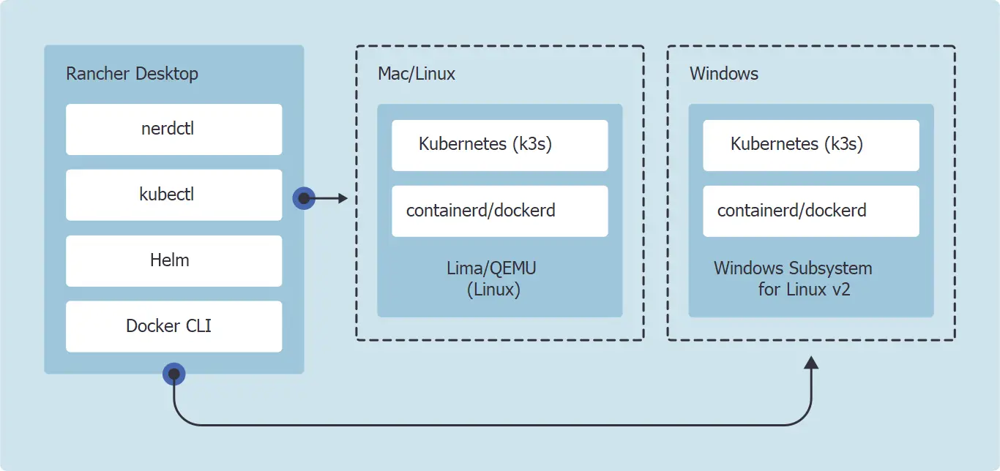
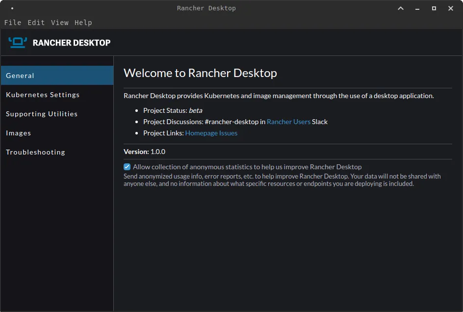
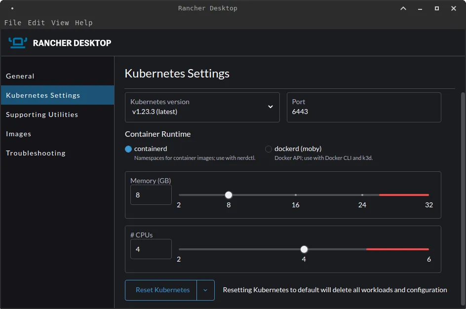
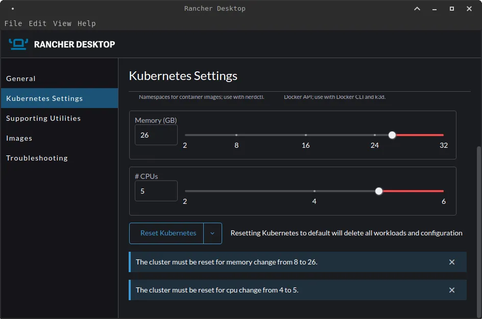
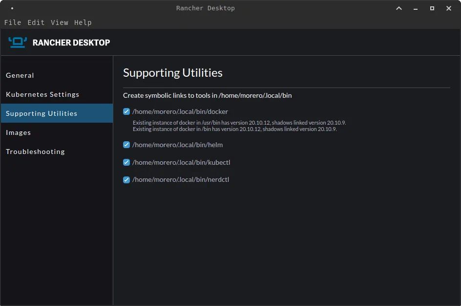
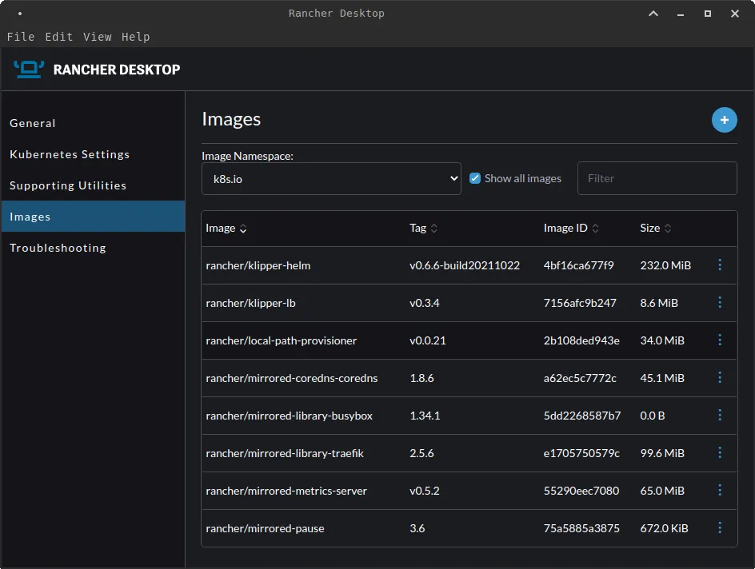
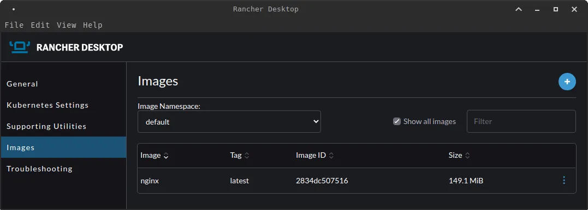
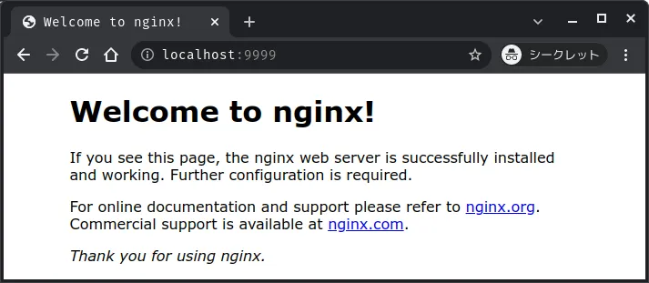

# MXLinux で Rancher Desktop を動かす


1 月 26 日に、[Rancher Desktop](https://rancherdesktop.io/) が正式に [v1.0.0](https://github.com/rancher-sandbox/rancher-desktop/releases/tag/v1.0.0) としてリリースされました.

今回は、実際に Rancher Desktop を MXLinux にインストールして動かそうと思います.

<!--more-->

## Rancher Desktop とは

Rancher Desktop は Electron と Node.js をベースに構築されたデスクトップアプリケーションであり、デスクトップ上で Kubernetes とコンテナ管理を実行することができます.

また、実行する Kubernetes のバージョンを自由に選択することができます.

`containerd`、または`Moby (dockerd)`を使って、コンテナイメージのビルド、プッシュ、プル、実行が可能です. ビルドしたコンテナイメージは、レジストリを必要とせず、すぐに Kubernetes で実行できます.

## 必要条件

OSS のデスクトップアプリケーションで、macOS や Windows、そして Linux の様々な環境で動作させることができます. M1 にも対応しているため、ほとんどの環境で動作が可能になりました.

環境での必要条件は以下の通りです.

### macOS

- **macOS**
  - Catalina 10.15 以降
- **CPU アーキテクチャ**
  - Apple Silicon（M1）または VT-x 搭載の Intel CPU

### WindowsOS

- **Windows**
  - Windows 10 ビルド 1909 以降
  - Home エディションにも対応
- **Hyper-V(仮想化機能)** が有効化されている
- **Windows Subsystem for Linux (WSL)**
  - Rancher Desktop は、Windows 上で WSL が必要ですが、セットアップの一部として自動的にインストールされます
  - 手動でディストリビューションをダウンロードは不要

### Linux

- `.deb`や`.rpm`パッケージ、または`AppImages`をインストールできるディストリビューション

### マシンスペック

- 8GB のメモリー
- 4 コアの CPU

## 動作の仕組み

Rancher Desktop は、他のツールをラッピングしながら、動作を実現しています.

MacOS と Linux では、[Lima](https://github.com/lima-vm/lima) や [QEMU](https://www.qemu.org/) といった仮想マシンを活用して`containerd`または`dockerd`と Kubernetes ([k3s](https://k3s.io/)) を実行します.

Windows システムでは、[Windows Subsystem for Linux v2 (WSL2)](https://docs.microsoft.com/en-us/windows/wsl/) を利用しています.

> 下図は [rancher](https://rancherdesktop.io/) から引用
> 

Rancher Desktop では、[NERDCTL プロジェクト](https://github.com/containerd/nerdctl)と Docker CLI を利用して、イメージを build、push、pull する機能が用意されています.
なお、`nerdctl`と`docker`の両方が自動的にパスに入れられます. Windows ではインストーラー中に、macOS と Linux では初回実行時に行われます.

いずれのツールを使用する場合も、Rancher Desktop が適切なコンテナランタイムで実行されている必要があります.

`nerdctl`の場合は、`containerd`ランタイムを使用します。docker の場合は、`dockerd (moby)`ランタイムを使用します.


**Lima** は WSL と似ており、自動ファイル共有とポート転送、および `containerd` を備えた Linux の仮想マシンを起動します.
Lima は macOS ホストで使われることが想定されていますが、Linux ホストでも使うことができます.



**QEMU** は、OSS の PC エミュレーターです.
`x86` や `SPARC`、`MIPS` といったさまざまな CPU 上の Linux、Windows などで動作し、ほかの CPU の命令をネイティブコードに変換しながら実行できるという特徴を持ちます.



**k3s** は、Rancher Labs 社が発表した軽量な Kubernetes の 1 つで、小さいサイズなバイナリと、メモリ使用量が少ないを特徴としています.
最近では、IoT や Edge コンピューティングなどでの活用が期待されています.



**nerdctl** は containerd 向けのコンテナの操作ツールです. `containerd` 用の `docker` コマンドだと考えていただければと思います.


## MXLinux へのインストール

Rancher Desktop を Linux ディストリビューションの 1 つである [MXLinux](https://mxlinux.org/) にインストールしてみます.

インストール方法は[公式ドキュメント](https://docs.rancherdesktop.io/installation#linux)に従って、Rancher Desktop のリポジトリを追加し、Rancher Desktop をインストールします.

Linux へのインストールはいくつかのパッケージがありますが、MXLinux は Debian(stable) ベースのため、`.deb`パッケージを使用します.

```bash
# リポジトリを取得し、登録
$ curl https://download.opensuse.org/repositories/isv:/Rancher:/stable/deb/Release.key | sudo apt-key add -
$ sudo add-apt-repository 'deb https://download.opensuse.org/repositories/isv:/Rancher:/stable/deb/ ./'

# パッケージ一覧を更新
$ sudo apt update

# Rancher Desktop をインストール
$ sudo apt install rancher-desktop
```

以上で、Rancher Desktop のインストールは完了です. 非常に簡単ですね.


**MXLinux** は [DistroWatch.com](https://distrowatch.com/) でも 注目度の高い Linux ディストリビューションです. antiX と旧 MEPIS Linux コミュニティ間の共同事業として構築されたプロジェクトでギリシャおよびアメリカにて開発されています.


## Rancher Desktop の起動

インストールした Rancher Desktop を起動してみます. アプリケーション自体は非常にシンプルでした.

### General



### Kubernetes Setting

次に、Kubernetes の設定を見てみます.



`Kubernetes version`では、Kubernetes のバージョンを指定できます. 執筆時点での最新バージョンである `v1.23.3` から、最も古いバージョンで `v1.16.7` まで選択が可能です.

`Port`はデフォルトでは、`6443`が設定されています.

`Container runtime`では、`containerd`または`dockerd (moby)`のどちらかを選択可能です.

`Memory (GB)`, `CPUs`は、メモリー、CPU のコア数を指定できます. 赤いラインまで数値を上げると、下図のように警告文が表示されます.



一度、環境をクリーンアップしたい場合は、`Reset Kubernetes`を押すことで簡単にリセットすることができます.

### Supporting Utilities

`Supporting Utilities`では、インストールされたツール郡が表示されています. 既にインストールされていた Docker などに対しては、丁寧に注意喚起が書かれていました.



### Images

`Images` では、Rancher Desktop で使用しているイメージが表示されています. イメージ一覧の`⋮`から`Scan`を選択すると、イメージの脆弱性を [Trivy](https://github.com/aquasecurity/trivy) を使用してスキャンしてくれる.



ここで、`Image Namespace`に注目してください. `containerd`では、Kubernetes と同様に`namespace`という概念が存在しています.
そのため、Kubenetes が `namespace`を持つことができるように、`containerd`も同じように`namespace`を持つことができます.
上図では、`namespace:k8s.io`にイメージが存在しているということになります.

実際に`nerdctl`コマンドを使用して、`namespace`を確認してみます. `nerdctl namespace list`で`namespace`の一覧を表示します.

```bash
$ ./.local/bin/nerdctl namespace list
NAME        CONTAINERS    IMAGES    VOLUMES
buildkit    0             0         0
k8s.io      22            16        0
```

実行してみると、`k8s.io`にイメージが存在していることが確認できました.

また、`nerdctl --namespace k8s.io ps`で`namespace:k8s.io`で、Rancher Desktop で作成した Kubernetes のコンテナ群が確認できます.

```bash
$ ./.local/bin/nerdctl --namespace k8s.io ps
CONTAINER ID    IMAGE                                               COMMAND                   CREATED           STATUS    PORTS    NAMES
1f642d94e7d5    docker.io/rancher/klipper-lb:v0.3.4                 "entry"                   50 minutes ago    Up                 k8s://kube-system/svclb-traefik-svnfr/lb-port-443
2ca56d5f0874    docker.io/rancher/mirrored-library-traefik:2.5.6    "/entrypoint.sh --gl…"    49 minutes ago    Up                 k8s://kube-system/traefik-6bb96f9bd8-cflf4/traefik
2f1c800451cf    docker.io/rancher/mirrored-coredns-coredns:1.8.6    "/coredns -conf /etc…"    49 minutes ago    Up                 k8s://kube-system/coredns-5789895cd-wgxlq/coredns
56bd8fba2fda    docker.io/rancher/klipper-lb:v0.3.4                 "entry"                   50 minutes ago    Up                 k8s://kube-system/svclb-traefik-svnfr/lb-port-80
5908afd18045    docker.io/rancher/mirrored-pause:3.6                "/pause"                  49 minutes ago    Up                 k8s://kube-system/coredns-5789895cd-wgxlq
8c16131e6d1b    docker.io/rancher/mirrored-pause:3.6                "/pause"                  50 minutes ago    Up                 k8s://kube-system/svclb-traefik-svnfr
95b859fec9ed    docker.io/rancher/mirrored-pause:3.6                "/pause"                  49 minutes ago    Up                 k8s://kube-system/local-path-provisioner-6c79684f77-plbxh
a0656b86ab35    docker.io/rancher/local-path-provisioner:v0.0.21    "local-path-provisio…"    49 minutes ago    Up                 k8s://kube-system/local-path-provisioner-6c79684f77-plbxh/local-path-provisioner
a5c31106d6d7    docker.io/rancher/mirrored-pause:3.6                "/pause"                  49 minutes ago    Up                 k8s://kube-system/traefik-6bb96f9bd8-cflf4
c9417746b27d    docker.io/rancher/mirrored-pause:3.6                "/pause"                  49 minutes ago    Up                 k8s://kube-system/metrics-server-7cd5fcb6b7-4cbkd
ce64e7b0a242    docker.io/rancher/mirrored-metrics-server:v0.5.2    "/metrics-server --c…"    49 minutes ago    Up                 k8s://kube-system/metrics-server-7cd5fcb6b7-4cbkd/metrics-server
```

### Troubleshooting

`Troubleshooting`では、ログの有効化、また Rancher Desktop 自体の初期化ができます.


## 検証

Rancher Desktop 上で、実際にコンテナなどを動かして見ます.

### nerdctl の使用

`nerdctl`コマンドを使用して、nginx を起動してみます. `namespace` は未指定の場合、デフォルトで`default`に配置されます.

#### nginx を起動

```bash
$ ./.local/bin/nerdctl run -d -p 9999:80 nginx
docker.io/library/nginx:latest:                                                   resolved       |++++++++++++++++++++++++++++++++++++++|
index-sha256:2834dc507516af02784808c5f48b7cbe38b8ed5d0f4837f16e78d00deb7e7767:    done           |++++++++++++++++++++++++++++++++++++++|
...
elapsed: 7.2 s                                                                    total:  54.1 M (7.5 MiB/s)
484e86556e00843200c97b5aa779ba81a9016796e23964e5a0cac27159de444e
```

#### コンテナの状態を確認

```bash
$ ./.local/bin/nerdctl ps
CONTAINER ID    IMAGE                             COMMAND                   CREATED          STATUS    PORTS                   NAMES
484e86556e00    docker.io/library/nginx:latest    "/docker-entrypoint.…"    6 minutes ago    Up        0.0.0.0:9999->80/tcp    nginx-484e8
```

#### namespace を確認

```bash
$ ./.local/bin/nerdctl namespace list
NAME      CONTAINERS IMAGES VOLUMES
buildkit  0          0      0
default   1          1      0
k8s.io    22         16     0
```

#### namespace default のプロセスを確認

```bash
$ ./.local/bin/nerdctl --namespace default ps
CONTAINER ID IMAGE COMMAND CREATED STATUS PORTS NAMES
484e86556e00 docker.io/library/nginx:latest "/docker-entrypoint.…" 11 minutes ago Up 0.0.0.0:9999->80/tcp nginx-484e8
```

また、Rancher Desktop からも`namespace:default`に nginx イメージを確認することができます.



最後に、`localhost:9999`にアクセスして、nginx の起動を確認してみます.



### Helm の使用

Rancher Desktop では、起動時に Helm もインストールされるので、Helm を使って Kubernetes に Grafana をデプロイしてみます.

#### Helm に Grafana のリポジトリを追加

```bash
$ ./.local/bin/helm repo add grafana https://grafana.github.io/helm-charts
```

#### Helm にリポジトリが追加されていることを確認

```bash
$ ./.local/bin/helm repo list
NAME    URL
grafana https://grafana.github.io/helm-charts
```

#### 追加した Grafana リポジトリからチャートを確認

```bash
$ ./.local/bin/helm search repo grafana
NAME                            CHART VERSION   APP VERSION DESCRIPTION
grafana/grafana                 6.21.1          8.3.4       The leading tool for querying and visualizing t...
grafana/grafana-agent-operator  0.1.5           0.22.0      A Helm chart for Grafana Agent Operator
grafana/enterprise-logs         2.0.0           v1.3.0      Grafana Enterprise Logs
grafana/enterprise-metrics      1.7.3           v1.6.1      Grafana Enterprise Metrics
grafana/fluent-bit              2.3.0           v2.1.0      Uses fluent-bit Loki go plugin for gathering lo...
grafana/loki                    2.9.1           v2.4.2      Loki: like Prometheus, but for logs.
grafana/loki-canary             0.5.1           2.4.1       Helm chart for Grafana Loki Canary
grafana/loki-distributed        0.42.0          2.4.2       Helm chart for Grafana Loki in microservices mode
grafana/loki-simple-scalable    0.2.0           2.4.2       Helm chart for Grafana Loki in simple, scalable...
grafana/loki-stack              2.5.1           v2.1.0      Loki: like Prometheus, but for logs.
grafana/promtail                3.10.0          2.4.2       Promtail is an agent which ships the contents o...
grafana/tempo                   0.13.0          1.3.0       Grafana Tempo Single Binary Mode
grafana/tempo-distributed       0.15.0          1.3.0       Grafana Tempo in MicroService mode
grafana/tempo-vulture           0.2.0           1.3.0       Grafana Tempo Vulture - A tool to monitor Tempo...
```

#### Helm チャートをリリース

```bash
$ ./.local/bin/kubectl create namespace monitoring
$ ./.local/bin/helm install grafana --namespace monitoring grafana/grafana
W0128 03:37:33.477723  218028 warnings.go:70] policy/v1beta1 PodSecurityPolicy is deprecated in v1.21+, unavailable in v1.25+
W0128 03:37:33.480386  218028 warnings.go:70] policy/v1beta1 PodSecurityPolicy is deprecated in v1.21+, unavailable in v1.25+
W0128 03:37:33.538004  218028 warnings.go:70] policy/v1beta1 PodSecurityPolicy is deprecated in v1.21+, unavailable in v1.25+
W0128 03:37:33.538201  218028 warnings.go:70] policy/v1beta1 PodSecurityPolicy is deprecated in v1.21+, unavailable in v1.25+
NAME: grafana
LAST DEPLOYED: Fri Jan 28 03:37:32 2022
NAMESPACE: monitoring
STATUS: deployed
REVISION: 1
NOTES:
1. Get your 'admin' user password by running:

   kubectl get secret --namespace monitoring grafana -o jsonpath="{.data.admin-password}" | base64 --decode ; echo

2. The Grafana server can be accessed via port 80 on the following DNS name from within your cluster:

   grafana.monitoring.svc.cluster.local

   Get the Grafana URL to visit by running these commands in the same shell:

     export POD_NAME=$(kubectl get pods --namespace monitoring -l "app.kubernetes.io/name=grafana,app.kubernetes.io/instance=grafana" -o jsonpath="{.items[0].metadata.name}")
     kubectl --namespace monitoring port-forward $POD_NAME 3000

3. Login with the password from step 1 and the username: admin
#################################################################################
######   WARNING: Persistence is disabled!!! You will lose your data when   #####
######            the Grafana pod is terminated.                            #####
#################################################################################
```

上記の手順に従って、正常に Grafana にログインすることができました.


最後に、`kubectl`コマンドを使って Grafana が立ち上がっていることを確認します.

```bash
$ ./.local/bin/kubectl get all --namespace monitoring
NAME                           READY   STATUS    RESTARTS   AGE
pod/grafana-6b9d4f7f86-mwb4q   1/1     Running   0          15m

NAME              TYPE        CLUSTER-IP     EXTERNAL-IP   PORT(S)   AGE
service/grafana   ClusterIP   10.43.218.65   <none>        80/TCP    15m

NAME                      READY   UP-TO-DATE   AVAILABLE   AGE
deployment.apps/grafana   1/1     1            1           15m

NAME                                 DESIRED   CURRENT   READY   AGE
replicaset.apps/grafana-6b9d4f7f86   1         1         1       15m
```

以上のように、Rancher Desktop を起動するだけでアプリケーションの開発やデプロイが簡単に行うことができました.

## 所感

今回は、v1.0.0 がリリースされた Rancher Desktop を触ってみましたが、非常に完成度の高いツールでした. `containerd`、`nerdctl`を初めて触る方も Rancher Desktop は良い機会だと思います.

昨年、[Docker Desktop が有料化](https://www.docker.com/blog/updating-product-subscriptions/)が大きなニュースとなり、それに伴い、密かに代替案として注目されていた Rancher Desktop ですが、
Docker Desktop から乗り換えたとしても遜色なく利用できるかと思います. 万が一、Docker のランタイムを使用したいと思えば、Rancher Desktop 上から切り替えれば良いので、大して手間は掛かりません.

また、Kubernetes のバージョンをスムーズに切り替えられるのも個人的には大きなメリットなのかなと思います.

これから、コンテナを利用する手段の 1 つとして、広く普及していく可能性は大いにあり得るので、今後の動向に注目していきたいと思います.

