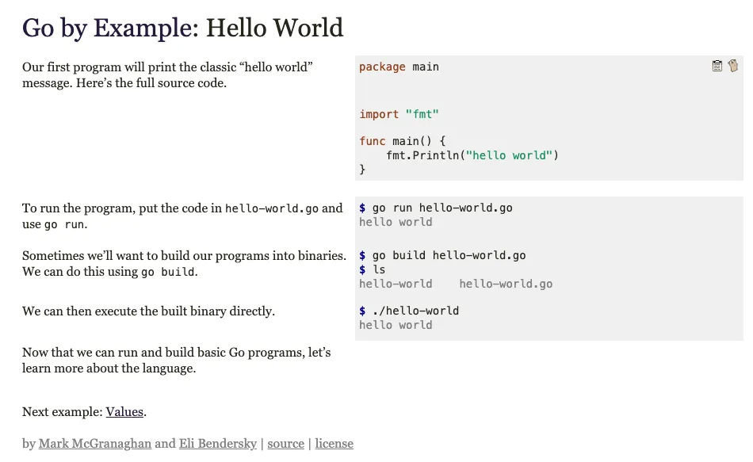
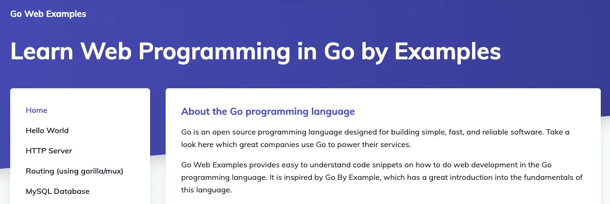
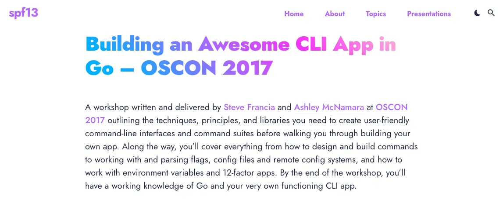
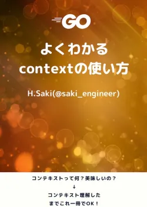
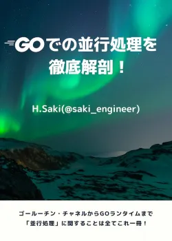

# Go 初学者ロードマップ

Go を初めて学ぶ方に向けて、ロードマップを作成してみました.

これから学んでいく第一歩として、参考にしていただければと思います.

<!--more-->

## はじめに

本ページは、筆者が全くの知見のない初学者が Go を学習し、利用していく上で必要な知識やスキルの習得方法を示したものです.

そのため、本ページでは概要や用語の説明などは行いません.

また、本ページの指針を全て達成することで Go の全てを網羅し、**完全に理解**できる訳ではありません.

必要な知識が必要な場合は個人で別途で調査、理解をする必要があることを予めご了承ください.

## Go とは？

Go は、2009 年、Google の Robert Griesemer、Robert "Rob" C. Pike、Kenneth Lane Thompson によって設計されました.

Go は以下の特徴を持っています.

- 静的型付け
- C 言語の伝統に則ったコンパイル言語
- メモリ安全性
- ガベージコレクション
- 構造的型付け
- CSP スタイルの並行性
- etc...

## はじめの一歩を踏み出す

Go を学ぶ第一歩として、まずは言語の理解が必要になります.

以下の 2 つの教材を使用して、学習するのが良いでしょう.

### A Tour of Go

[A Tour of Go](https://go-tour-jp.appspot.com/welcome/1)は Go を初めてさわる人に向けて提供されている教材になります.

日本語対応もされており、これ一つで Go 言語の機能の説明を一通り網羅しています.

### Gopher 道場

[Gopher 道場](https://gopherdojo.org/)は、Go 体系的に学べます.

また、Slack や GitHub 上なので質問なども行えるため、一人で勉強する場合も気軽に相談できます.

「[自習室](https://gopherdojo.org/studyroom/)」から、これまでの教材や動画が閲覧できるので、そちらを活用するのが良いかと思います.

## Go を写経する

言語の理解がある程度済んだら、次は実際に Go を「写経」してみましょう.

「写経」とは、参考書や実際のコードをそのまま写すことです. 内容は変更せず、そのまま書き写しましょう.

「写経」を行う事は、以下の理由で効果的に理解が深めることができます.

- 書くことによる記憶の定着
- ミスした場所等のチェック
  - タイポや記法のミスなどを即時に判断できる
- 実行結果の確認
  - 自分の書いたコードにより、どのような結果を得ることができたのかを理解できる

「写経」を行う上で、いくつかのサイトをご紹介します.

### Go by Example

[Go by Example](https://gobyexample.com/) は、各場面でのサンプルコードが数多く紹介されています.

サンプルコードも少なく、シンプルなものなので、コードを初めて読む方も理解しやすいと思います.

### Go Web Example

[Go Web Example](https://gowebexamples.com/) は、「Go by Example」と比べて、より実践的なコードを写経することができます.

例えば、HTTP サーバの作成や、ルーティングなどが挙げられます.

また、RDB の CRUD 処理なども学ぶことができます.

### Building an Awesome CLI App in Go – OSCON 2017

[こちら](https://spf13.com/presentation/building-an-awesome-cli-app-in-go-oscon/)のソースは少し古くはなりますが、Go を用いた CLI の作成を`Cobra`と呼ばれるフレームワークを用いて行うことができます.

近年では Go で書かれた CLI が数多くでてきてます.

普段の開発で CLI の開発を行う機会は少ないかと思うので、挑戦してみると良いと思います.

## おすすめの書籍、文献など

ここでは、ロードマップにそって学習を行う上で著者自身がお薦めする書籍や、文献などを紹介します.

### 文献

#### Effective Go

[Effective Go](https://go.dev/doc/effective_go) は、Go コードを書くための Tips がまとめられています.

こちらの文献を読む前に以下の文献も読んでおくと良いかと思います.

- [How to Write Go Code](https://go.dev/doc/code)
- [The Go Programming Language Specification](https://go.dev/ref/spec)

#### Go Code Review Comments

[Go Code Review Comments](https://github.com/golang/go/wiki/CodeReviewComments) は、「Effective Go」の補足として見ると良いです.

Go のコードをレビューする際の一般的なコメントがまとめられています.

### 書籍

#### Go プログラミング実践入門 標準ライブラリでゼロから Web アプリを作る

- Go をより実践的に使うためのポイントをわかりやすく説明しています
- しかし、Go についての基本理解を済ませてからの方が読みやすいです
- フレームワークに頼らず、Web の仕組みを理解し Go で実装できる点がおすすめです

<a href="https://www.amazon.co.jp/Go%E3%83%97%E3%83%AD%E3%82%B0%E3%83%A9%E3%83%9F%E3%83%B3%E3%82%B0%E5%AE%9F%E8%B7%B5%E5%85%A5%E9%96%80-%E6%A8%99%E6%BA%96%E3%83%A9%E3%82%A4%E3%83%96%E3%83%A9%E3%83%AA%E3%81%A7%E3%82%BC%E3%83%AD%E3%81%8B%E3%82%89Web%E3%82%A2%E3%83%97%E3%83%AA%E3%82%92%E4%BD%9C%E3%82%8B-impress-gear%E3%82%B7%E3%83%AA%E3%83%BC%E3%82%BA-Sheong-Chang-ebook/dp/B06XKPNVWV?__mk_ja_JP=%E3%82%AB%E3%82%BF%E3%82%AB%E3%83%8A&crid=2R9LPEJ0N3VCH&keywords=Go%E3%83%97%E3%83%AD%E3%82%B0%E3%83%A9%E3%83%9F%E3%83%B3%E3%82%B0%E5%AE%9F%E8%B7%B5%E5%85%A5%E9%96%80+%E6%A8%99%E6%BA%96%E3%83%A9%E3%82%A4%E3%83%96%E3%83%A9%E3%83%AA%E3%81%A7%E3%82%BC%E3%83%AD%E3%81%8B%E3%82%89Web%E3%82%A2%E3%83%97%E3%83%AA%E3%82%92%E4%BD%9C%E3%82%8B&qid=1652787039&sprefix=go%E3%83%97%E3%83%AD%E3%82%B0%E3%83%A9%E3%83%9F%E3%83%B3%E3%82%B0%E5%AE%9F%E8%B7%B5%E5%85%A5%E9%96%80+%E6%A8%99%E6%BA%96%E3%83%A9%E3%82%A4%E3%83%96%E3%83%A9%E3%83%AA%E3%81%A7%E3%82%BC%E3%83%AD%E3%81%8B%E3%82%89web%E3%82%A2%E3%83%97%E3%83%AA%E3%82%92%E4%BD%9C%E3%82%8B%2Caps%2C169&sr=8-1&linkCode=li2&tag=m0rer00e-22&linkId=e4a6b159ffe261e4ac7cfb32944d9371&language=ja_JP&ref_=as_li_ss_il" target="_blank"></a>

#### エキスパートたちの Go 言語

- メルカリのエンジニアが各章ごとに個人で作成したライブラリを紹介しています
- Go でのアーキテクチャや設計思想などを考える際に参考になるかと思います

#### 実用 Go 言語 ―システム開発の現場で知っておきたいアドバイス

- Go の基本的な知識をインプットしてから読むことをお薦めします
- Go を実用的に使っていくためのベストプラクティスがまとまっている感じです

<a href="https://www.amazon.co.jp/%E5%AE%9F%E7%94%A8-Go%E8%A8%80%E8%AA%9E-%E2%80%95%E3%82%B7%E3%82%B9%E3%83%86%E3%83%A0%E9%96%8B%E7%99%BA%E3%81%AE%E7%8F%BE%E5%A0%B4%E3%81%A7%E7%9F%A5%E3%81%A3%E3%81%A6%E3%81%8A%E3%81%8D%E3%81%9F%E3%81%84%E3%82%A2%E3%83%89%E3%83%90%E3%82%A4%E3%82%B9-%E6%B8%8B%E5%B7%9D-%E3%82%88%E3%81%97%E3%81%8D/dp/4873119693?__mk_ja_JP=%E3%82%AB%E3%82%BF%E3%82%AB%E3%83%8A&crid=TZ1Y1YBXOOMG&keywords=%E5%AE%9F%E7%94%A8go%E8%A8%80%E8%AA%9E+%E2%80%95%E3%82%B7%E3%82%B9%E3%83%86%E3%83%A0%E9%96%8B%E7%99%BA%E3%81%AE%E7%8F%BE%E5%A0%B4%E3%81%A7%E7%9F%A5%E3%81%A3%E3%81%A6%E3%81%8A%E3%81%8D%E3%81%9F%E3%81%84%E3%82%A2%E3%83%89%E3%83%90%E3%82%A4%E3%82%B9&qid=1652787116&sprefix=%E5%AE%9F%E7%94%A8+go+%E8%A8%80%E8%AA%9E+%E3%82%B7%E3%82%B9%E3%83%86%E3%83%A0%E9%96%8B%E7%99%BA%E3%81%AE%E7%8F%BE%E5%A0%B4%E3%81%A7%E7%9F%A5%E3%81%A3%E3%81%A6%E3%81%8A%E3%81%8D%E3%81%9F%E3%81%84%E3%82%A2%E3%83%89%E3%83%90%E3%82%A4%E3%82%B9%2Caps%2C166&sr=8-1&linkCode=li2&tag=m0rer00e-22&linkId=a2143e643f723af5c83c2ec382ecf07d&language=ja_JP&ref_=as_li_ss_il" target="_blank"></a>

#### Go 言語による並行処理

- Go を使う上で非常に重要となる、並行処理、`Goroutin`について丁寧に説明してくれています
- 並行処理に関しては、Go 関係なく一般的な考えなども記載されているので、並行処理を知らない方でも読んで見ると良いと思います
- また、例も多いので理解する際のイメージもしやすいと思います

<a href="https://www.amazon.co.jp/Go%E8%A8%80%E8%AA%9E%E3%81%AB%E3%82%88%E3%82%8B%E4%B8%A6%E8%A1%8C%E5%87%A6%E7%90%86-Katherine-Cox-Buday/dp/4873118468?__mk_ja_JP=%E3%82%AB%E3%82%BF%E3%82%AB%E3%83%8A&crid=3PBZTNLTXEGW1&keywords=go%E8%A8%80%E8%AA%9E%E3%81%AB%E3%82%88%E3%82%8B%E4%B8%A6%E8%A1%8C%E5%87%A6%E7%90%86&qid=1652787142&sprefix=go+%E8%A8%80%E8%AA%9E%E3%81%AB%E3%82%88%E3%82%8B%E4%B8%A6%E8%A1%8C%E5%87%A6%E7%90%86%2Caps%2C266&sr=8-1&linkCode=li2&tag=m0rer00e-22&linkId=1d41e49c1464163c2b0aea7f0a0c4f86&language=ja_JP&ref_=as_li_ss_il" target="_blank"></a>

#### よくわかる context の使い方

- Go の標準パッケージ、`context`パッケージについて詳細にかかれています
- 初学者にとっては使い道がわからないことがですが、使いこなせるとかなり便利なパッケージになります

#### Go での並行処理を徹底解剖！

- 並行処理について網羅的・徹底的にまとめられている
- 最初は並行処理は難易度が高いため、深く理解するのが難しいですが、本書でその問題が解決できるかもしれません

### e-Learning

#### gophercises

[gophercises](https://gophercises.com/#signup)は、Go の基本から応用的なアプリケーションの実装までを動画で紹介しています.

Go の基礎理解を一通り深めたあと、「何か試しに実装するものないかな？」と思った方は、このサイトを参考にサンプルコードを書いてみても良いでしょう.

## まとめ

Go の学習ロードマップを考えてまとめてみました.

Go のみならず、プログラミング言語の学習に近道はありません.

反復をくりかえし、少しづつ自分のものにしてきましょう.

また、「Go を学んで終わり！」というわけでもなくその周辺の知識も有していく必要があります。

@Alikhll さんの [こちら](https://github.com/Alikhll/golang-developer-roadmap/blob/master/i18n/ja-JP/ReadMe-ja-JP.md)のロードマップなどを参考に、より知識の幅を広げていって貰えればと思います.

