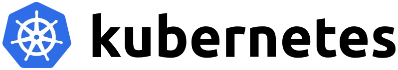
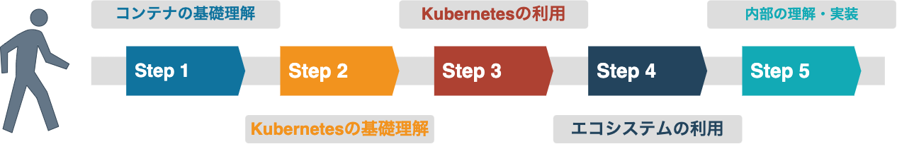
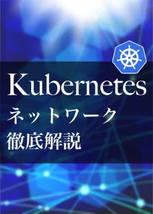

# Kubernetes初学者ロードマップ

Kubernetes を初めて学ぶ方に向けて、ロードマップを作成してみました.

これから学んでいく第一歩として、参考にしていただければと思います.

<!--more-->

## はじめに

本ページは、筆者が全くの知見のない初学者が Kubernetes を学習し、利用していく上で必要な知識やスキルの習得方法を示したものです.

そのため、本ページでは概要や用語の説明などは行いません.

また、本ページの指針を全て達成することで Kubernetes の全てを網羅し、**完全に理解**できる訳ではありません.

必要な知識が必要な場合は個人で別途で調査、理解をする必要があることを予めご了承ください.

## そもそも Kubernetes とは？

### Kubernetes の読み方

Kubernetes は、**クバネティス**、**クバネテス**、**クーべネティス**と呼び方は様々ありますが、読み方は人それぞれです.

また、`K8s`と略されることもあります.


**Kubernetes**(希: `κυβερνήτης`, `koo-ber-nay'-tace`, クベルネテス)は、ギリシャ語で**航海長**または**水先案内人**を意味し、サイバネティクス(人工頭脳学)の語源でもある

> 引用: <https://ja.wikipedia.org/wiki/Kubernetes>



### 何をしているの？

Kubernetes は、コンテナをデプロイできる基盤となるソフトウェアであり、コンテナオーケストレーターの 1 つです.

もともとは Google のコンテナ盤である Borg をベースにした OSS であり、2014 年 6 月にローンチされました.

現在は [**Cloud Native Computing Foundation (CNCF)**](https://www.cncf.io/) によって管理されている GA Project の 1 つです.


**CNCF** は、Cloud Native なシステムを推進するために 2015 年に創設された Linux Foundation 傘下の非営利団体の 1 つです.


## 学習ロードマップ

本題の学習のロードマップについてですが、個人的には以下の通りに学習を進めて行くのが良いと考えています.

### Step1. コンテナの基礎理解

Kubernetes を理解する上で、非常に密な関係性にあるのが**コンテナ**です.

まずは、コンテナについて理解を深めることが最重要になります. コンテナを理解している場合は、このステップはスキップしても良いでしょう.

理解がないまま Kubernetes を理解を深めること困難です. まずは、コンテナの理解を深めしょう.

コンテナと言っても、コンテナを動かすエンジンは複数種類あるので、まずは`Docker`に焦点をあてて、学習を進めて行きます.

#### Step1 を学ぶポイント

- コンテナとは何なのか？
- コンテナと仮想化の違いは？
- Dockerfile の記述方法
- Docker の操作方法
  - イメージのビルド
  - イメージのプッシュ
  - コンテナの起動

### Step2. Kubernetes の基礎理解

コンテナの基礎を理解した後は、Kubernetes の基礎を理解していきます.

Kubernetes を動かす前にまずは知識としてインプットしていくのが良いでしょう.

#### Step2 を学ぶポイント

- Kubernetes で実現できること
  - また、それがなぜ必要とされているのか
  - Kubernetes を使うメリット
- API リソース群の理解
- `kubectl` の使用方法

### Step3. Kubernetes の利用

コンテナや Kubernetes の基礎的な部分を理解した後は、実際に Kubernetes を触ってみましょう.

実際に Kubernetes を動かして、体系的に学ぶようにすることで理解を深めていきます.

Step1, Step2 でインプットした知識を、きちんとアウトプットしていくことで**ラーニングサイクル**を回すようにしましょう.

#### Step3 を学ぶポイント

- Kubernetes の一連の動作を試してみる
  - クラスターの作成
  - アプリケーションの操作 (`kubectl`での操作)
    - デプロイ
    - 探索
    - 公開
    - スケーリング
    - アップデート

### Step4. エコシステムの利用

Kubernetes には多くのエコシステムが提供されています.

エコシステムを活用することで、Kubernetes はより真価を発揮します.

また、本番環境などで運用する際、CI/CD や監視、ログ収集、セキュリティなど考慮する点が多く存在します.

エコシステムを利用することで、それらの課題を解決することができます.


元々は生態系の用語であり、あるエリア(地域や空間など)の生命体が互いに依存しながら生態を維持する関係の様子を表します. ここでは、Kubernetes を支えるツール群のことを指しています.


#### Step4 を学ぶポイント

- Kubernetes を運用する上でどのような点を考慮する必要があるのか
- どのようなエコシステムがあるのか

### Step5. 内部ツールの理解・実装

しかし、実際にマネージドクラウド(AWS, GCP, Azure など)で運用する場合、あまり気にする必要はありません.

個人で Kubernetes のコントローラーなどを開発していきたい方は Step 5 に挑戦してみましょう.

なお、Kubernetes 関連の周辺ツールは、Go 言語で書かれている事が多いです.

Go 言語を初めて触る方は、後日記載予定の「Go 言語学習ロードマップ」をご覧いただければと思います.

#### Step5 を学ぶポイント

- カスタムコントローラーの基礎の理解
- 公開されているカスタムコントローラー群の理解
- カスタムコントローラーの実装、動作検証

## おすすめの書籍、文献など

ここでは、ロードマップにそって学習を行う上で著者自身がお薦めする書籍や、文献などを紹介します.

### 書籍

#### 仕組みと使い方がわかる Docker＆Kubernetes のきほんのきほん

- 対象
  - Step1
  - Step2
- コンテナに初めて触れる方やバックエンドの技術に詳しくない方でも Linux の知識や、サーバの基礎なども併せて記載されているため読みやすいです
- イラストも多く、視覚的に知識をインプットすることができます

<a href="https://www.amazon.co.jp/%E4%BB%95%E7%B5%84%E3%81%BF%E3%81%A8%E4%BD%BF%E3%81%84%E6%96%B9%E3%81%8C%E3%82%8F%E3%81%8B%E3%82%8B-Docker%EF%BC%86Kubernetes%E3%81%AE%E3%81%8D%E3%81%BB%E3%82%93%E3%81%AE%E3%81%8D%E3%81%BB%E3%82%93-Compass-Books%E3%82%B7%E3%83%AA%E3%83%BC%E3%82%BA-%E5%B0%8F%E7%AC%A0%E5%8E%9F-ebook/dp/B08T961HKP?__mk_ja_JP=%E3%82%AB%E3%82%BF%E3%82%AB%E3%83%8A&crid=3OZORHAGRHLNJ&keywords=docker&qid=1652509596&refinements=p_72%3A2275269051&rnid=2275267051&s=digital-text&sprefix=docker%2Cdigital-text%2C166&sr=1-3&linkCode=li2&tag=m0rer00e-22&linkId=29136c59c8b11b9bb0449836fc8e286c&language=ja_JP&ref_=as_li_ss_il" target="_blank"></a>

#### Docker コンテナ開発・環境構築の基本

- 対象
  - Step1
  - Step2
- コンテナを体系的に学ぶことができます
- コンテナを用いた CI/CD、アプリケーションの運用方法も基本から記載されています

#### イラストでわかる Docker と Kubernetes

- 対象
  - Step1
  - Step2
- Docker や Kubernetes の知識を有していない場合はまずこれを読んだほうがイメージはつかみやすいかと思います
  - 概要がメインなので、サラッと読むには良いと思います

#### Kubernetes 完全ガイド 第 2 版

- 対象
  - Step2
  - Step3
- 一番時初めにこの書籍から読み始めるのは少し難易度が高いため、上記の書籍を読んでから読むと良いです
- Kubernetes に関する知識が網羅的にまとめられています
- Kubernetes を使用していて、困った時にリファレンスとしても活用できます

#### Kubernetes CI/CD パイプラインの実装

- 対象
  - Step4
- 題名の通り、CI/CD のパイプラインを構築について詳細に記されている

#### Docker/Kubernetes 開発・運用のためのセキュリティ実践ガイド

- 対象
  - Step3
  - Step4
- Docker や Kubernetes の知識はある程度有していないと読むのは難しいと思います
- Kubernetes 上での開発、運用視点からのセキュリティ対策についてまとめられていています

<a href="https://www.amazon.co.jp/Docker-Kubernetes%E9%96%8B%E7%99%BA%E3%83%BB%E9%81%8B%E7%94%A8%E3%81%AE%E3%81%9F%E3%82%81%E3%81%AE%E3%82%BB%E3%82%AD%E3%83%A5%E3%83%AA%E3%83%86%E3%82%A3%E5%AE%9F%E8%B7%B5%E3%82%AC%E3%82%A4%E3%83%89-Compass-Books%E3%82%B7%E3%83%AA%E3%83%BC%E3%82%BA-%E9%A0%88%E7%94%B0-ebook/dp/B085C8LYDC?__mk_ja_JP=%E3%82%AB%E3%82%BF%E3%82%AB%E3%83%8A&crid=2UB37LVU06166&keywords=docker&qid=1652509151&refinements=p_72%3A2275269051&rnid=2275267051&s=digital-text&sprefix=docker%2Caps%2C260&sr=1-8&linkCode=li2&tag=m0rer00e-22&linkId=3e11a8f254e14f7d8f201c3703e7f9d7&language=ja_JP&ref_=as_li_ss_il" target="_blank"></a>

#### 実践入門 Kubernetes カスタムコントローラーへの道

- 対象
  - Step5
- Kubernetes で拡張機能(カスタムコントローラー)を開発する入門です

<a href="https://www.amazon.co.jp/%E5%AE%9F%E8%B7%B5%E5%85%A5%E9%96%80-Kubernetes%E3%82%AB%E3%82%B9%E3%82%BF%E3%83%A0%E3%82%B3%E3%83%B3%E3%83%88%E3%83%AD%E3%83%BC%E3%83%A9%E3%83%BC%E3%81%B8%E3%81%AE%E9%81%93-%E6%8A%80%E8%A1%93%E3%81%AE%E6%B3%89%E3%82%B7%E3%83%AA%E3%83%BC%E3%82%BA%EF%BC%88NextPublishing%EF%BC%89-%E7%A3%AF-%E8%B3%A2%E5%A4%A7/dp/4844378546?__mk_ja_JP=%E3%82%AB%E3%82%BF%E3%82%AB%E3%83%8A&crid=2J9AWAYV9O5PE&keywords=kubernetes&qid=1652514210&sprefix=kubernete%2Caps%2C177&sr=8-15&linkCode=li2&tag=m0rer00e-22&linkId=9a58d18c159b1c8ae59d0fefa64a2a16&language=ja_JP&ref_=as_li_ss_il" target="_blank"></a>

#### Kubernetes ネットワーク 徹底解説

- Kubernetes のネットワークの実現方法について説明されています
  - TCP/IP は知っているが、Kubernetes のネットワークの実現方法は知らない人向けに、噛み砕いて体系的に説明してくれている

### e-Learning

#### Katacoda

[Katakoda](https://www.katacoda.com/)は、ブラウザ環境で学習が行えるプラットフォームです.

コンテナ周辺の技術などのトレーニングが公開されており、全てブラウザ環境でコマンド、ターミナル環境が提供されているため、環境構築などの手間などなく学習を行うことができます.

#### Kubernetes 学習とトレーニング (Microsoft)

Microsoft が提供している、トレーニングになります.

動画ベースで各項目を説明しており、Kubernetes の基本を理解すると共に、様々な Kubernetes の機能などについても解説してくれています.

トレーニングは、[こちら](https://azure.microsoft.com/ja-jp/resources/kubernetes-learning-and-training/#overview)から受講することができます.

#### つくって学ぶ Kubebuilder

[@zoetrope](https://github.com/zoetrope?tab=repositories)さんによって提供されており、Kubebuilder と呼ばれるフレームワークを使用して、Kubernetes を拡張するためのカスタムコントローラー/オペレーターを開発するため方法を解説されています.

Step5 に進まれた方は、この記事を読んでカスタムコントローラー/オペレーターの開発手法を理解すると良いでしょう.

## その他

### 情報収集

Kubernetes の情報を収集する際には基本的には以下を使用しています.

- [Kubernetes Official](https://kubernetes.io/)
  - [Document](https://kubernetes.io/docs/home/)
  - [Reference](https://kubernetes.io/docs/reference/)
  - [Blog](https://kubernetes.io/blog/)
- [GitHub](https://github.com/kubernetes)
  - [kubernetes/kubernetes](https://github.com/kubernetes/kubernetes)
- News
  - [KubeWeekly](https://us10.campaign-archive.com/home/?u=3885586f8f1175194017967d6&id=11c1b8bcb2)
  - [Kubernetes Podcast](https://kubernetespodcast.com/)
  - [Kubernetes on Medium](https://medium.com/tag/kubernetes/latest)

### コミュニティの参加

#### Kubernetes Slack

Kubernetes の Slack になります. Join は[こちら](http://slack.k8s.io/)からできます.

※ 既に Join 済みの場合は、[こちら](https://kubernetes.slack.com/)からサインインできます.

初めて参加する方は以下のチャンネルに参加すると良いと思います.

- `#jp-users`
- `#jp-events`
- `#jp-dev`
- `#jp-mentoring`
- `#jp-users-novice`
- `#kubernetes-doc-ja`

初学者の方で質問などを行いたい場合は、`jp-users-novice`で聞いてみると良いでしょう.

### 勉強会など

#### [Kubernetes Meetup Tokyo](https://k8sjp.connpass.com/)

国内では最大の Kubernetes の勉強会になります.

過去の勉強会の動画は[こちら](https://www.youtube.com/c/KubernetesMeetupTokyo)から見ることができます.

#### [Kubernetes Meetup Novice](https://k8s-novice-jp.connpass.com/)

「まだ、学び始めたばっかりだけど発表してみたい」という方向けの勉強会になります.

過去の勉強会の動画は[こちら](https://www.youtube.com/channel/UC4EPkXFGaMA_BZ0N6unnQIAz)から見ることができます.

#### [Kubernetes 変更内容共有会](https://kubernetes-updates.connpass.com/)

Kubernetes のバージョンアップごとの変更内容で重要な部分や、面白いポイントを紹介してくれる勉強会になります.

Kubernetes のバージョンに追従してくためにこちらの勉強会を活用してみても良いと思います.

過去の勉強会の動画は[こちら](https://www.youtube.com/channel/UC9bxCiEy9Nocy5UQHfG_6Yw)から見ることができます.

#### Kubernetes Internal

Kubernetes をより深く掘り下げ、その他の周辺ツールなどの実装や設計などについて情報交換、交流をするための勉強会です.

現在は、「kubenews」が毎週開催されています.

過去の勉強会の動画は[こちら](https://www.youtube.com/channel/UCpkd51NdxThtTSR3L6T83fw)から見ることができます.

#### [OCHa(Oracle Cloud Hangout cafe) Cafe](https://ochacafe.connpass.com/)

Kubernetes 以外にクラウドネイティブな技術全般について発信しています.

過去の勉強会の動画は[こちら](https://www.youtube.com/c/JapanOracleDevelopers)から見ることができます.

#### [KubeConn + CloudNativeConn](https://www.cncf.io/kubecon-cloudnativecon-events/)

KubeCon + CloudNativeCon は、Cloud Native Computing Foundation (CNCF) の主力カンファレンスカンファレンスとして開催されています.

Kubernetes のみならず、クラウドネイティブに関するコミュニティが一同に集結し、クラウドネイティブな技術の教育と進歩を推進しています.

#### [Cloud Native Days](https://cloudnativedays.connpass.com/)

日本最大級のクラウドネイティブ・テックカンファレンスを開催しています.

過去のカンファレンスの動画は[こちら](https://www.youtube.com/channel/UCMBw1Z3fmhe-2l-iq2p4rNw)から見ることができます.

### 資格

Kubernetes では、Linux Foundation と Cloud Native Computing Foundation (CNCF) が行っている試験が一番有名だと思います.

#### [CKA (Certified Kubernetes Administrator)](https://training.linuxfoundation.org/ja/certification/certified-kubernetes-administrator-cka/)

Kubernetes の基本的な機能に加え、基盤自体の運用方法やトラブルシュートなどの理解が求められます.

Kubernetes の基盤開発者向けの試験になります.

※ [日本語での試験](https://training.linuxfoundation.org/ja/certification/certified-kubernetes-administrator-cka-jp/)が可能です.

#### [CKAD (Certified Kubernetes Application Developer)](https://training.linuxfoundation.org/ja/certification/certified-kubernetes-application-developer-ckad/)

CKA と比べ、アプリケーション開発者向けの試験になります.

Kubernetes の基本的な機能に加え、Kubernetes をアプリをデプロイ・運用する基盤として十分に利用できるスキルがあるかが求められます.

※ [日本語での試験](https://training.linuxfoundation.org/ja/certification/certified-kubernetes-application-developer-ckad-jp/)が可能です.

#### [CKS (Certified Kubernetes Security Specialist)](https://training.linuxfoundation.org/ja/certification/certified-kubernetes-security-specialist/)

CKA の試験を更にセキュリティに焦点を当てた試験となります.

この試験を受けるには、事前に CKA に合格している必要があります.

## まとめ

今回は、Kubernetes の学習ロードマップを考えてまとめてみました.

筆者自身も Kubernetes を触り始めてまだ日が浅いため、上記のものを参考に日々精進しています.

これをきっかけに一人でも多くの方が Kubernetes に興味をもっていただけることを切に願います.

