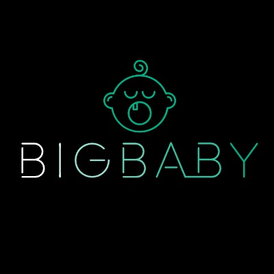

# WHORU?

## 基本情報

| 項目     | 内容                                                                        |
| :------- | :-------------------------------------------------------------------------- |
| 氏名     | 岡本 泰典 (オカモト タイスケ)                                               |
| 生年月日 | 1996/12/02                                                                  |
| 最終学歴 | 大阪工業大学 情報科学部 ネットワークデザイン学科 (旧: 情報ネットワーク学科) |

## 保有スキル

- Golang でのバックエンド開発、設計、テスト、運用、保守
- クリーンアーキテクチャを意識したコーディング
- TDD でのテストコード開発
- Kubernetes でのサービス開発、設計、テスト、運用、保守
- Kubernetes コンポーネントの開発、設計、テスト、運用、保守
- Prometheus, Grafana を使用した監視メトリクスの収集
- CI / CD の環境構築、運用
- DRM の資格([CWIP](https://www.widevine.com/): Certified Widevine Implementation Partner)の保有

## 技術スタック

| カテゴリ                                       | 技術スタック                                            |
| :--------------------------------------------- | :---------------------------------------------------|
| Programming language / Library etc.              | Go, Python, Java, PHP, C, Solidity                |
| Programming language / Library etc. (individual) | C++, C#, V, Zig, gRPC                             |
| Framework                                      | Gin(Go), Falcon(Python), Spring Boot(Java)          |
| Infrastructure                                 | GCP                                                 |
| Middleware                                     | Redis, Memorystore                                  |
| Database                                       | MySQL, PostgreSQL(individual), Cloud SQL            |
| Data analytics                                 | BigQuery                                            |
| Environment setup                              | Ansible, Cloud Build, Docker, Terraform(individual) |
| Container Orchestration                        | Kubernetes, Rancher, CloudRun                       |
| IaaS                                           | CloudStack, vSphere                                 |
| CI                                             | ArgoCD, CircleCI, Cloud Build, GitHub Actions       |
| Monitoring                                     | Prometheus, Grafana                                 |
| Service Mesh                                   | Istio, Linkerd(individual)                          |
| Code Management                                | GitHub, GitLab, Bitbucket                           |

## 職務経歴詳細

### 株式会社 IDC フロンティア (2021/09 ~ 現在)

| 項目                | 内容    |
| :----------------- | :------ |
| プロジェクト規模       | 約 20 名 (内チーム: 2名)  |
| 役割 | 機能検討、設計、コーディング、その他、調査、研究など |
| 業務内容 | Kubernetes as a Service (KaaS) 開発 |

- CloudStack の CSI Drive/Cloud Controller Manager/Ingress Controller の各種機能・実装の調査・研究
- Rancher 向けの Cluster Autoscaler の開発、実装
- vSphere をベースとしたプライベートクラウドの開発、実装
- Kubernetes Addon の自動化、独自機能の実装
- 社内でのコンテナ / Kubernetes の普及・促進活動

### パペルック株式会社 (2021/02 ~ 2021/08)

| 項目                | 内容    |
| :----------------- | :------ |
| プロジェクト規模       | 約 2 名  |
| 役割 | テックリード、機能検討、設計、コーディング、レビュー |
| 業務内容 | 自社の商品発注管理システムの開発・運用 |

- Go 言語での API 開発
- GCP 内で完結するサービスの運用
- CloudBuild + CloudRun での CI/CD の構築、及び開発スピードの促進
- 自社で使用している EC プラットフォーム(Shopify)との連携

| 項目                | 内容    |
| :----------------- | :------ |
| プロジェクト規模       | 個人開発 |
| 役割 | 機能検討、設計、コーディング、クライアントとの仕様検討、及び交渉 |
| 業務内容 | 中国、韓国 EC サイトと自社サービスとの連携システムの開発・運用 |

- Go 言語での API, バッチ処理, Webhook の実装
  - バッチ処理ではGoroutineを使用し、2~3 万件/日の登録・更新処理を実施
- Slack とのWebhookでの連携を行い、エラー発生時などの早期検知を実現

また、その他に以下の業務を兼務

- 社内インフラの整備、及び保守
- D2C 事業でのクライアントのサイトの構築、及び運用、保守
- Google App Script + Google Analytics を使用し、自社 EC サイトの日時レポートの自動化

### 株式会社ビデオマーケット (2019/04 ~ 2021/01)

| 項目                | 内容    |
| :----------------- | :------ |
| プロジェクト規模       | 約 20 名 (内チーム: 4名) |
| 役割 | APIの機能検討・設計・コーディング・レビュー、Kubernetes環境の構築・レビュー、監視ツールの導入、CI/CDの導入 |
| 業務内容 | 配信サービス内の再生基盤のリニューアル |

- 既存で動いている PHP の再生基盤を Golang へリプレイス
- GKE を使用したマイクロサービス化
- Kustomizeなどのマニフェスト管理ツールを用いることで、マニフェストの管理コストの削減を実現
- サービスメッシュを活用し、マイクロサービス間の通信をセキュアに保つ
- 使用用途を切り分け、それぞれに BigQuery, Redis など適した DB を導入
- Grafana, Prometheus を用いたアラートの実装

また、業務の一環として以下の DRM の資格を取得

- CWIP (Certified Widevine Implementation Partner)
  - 2020 年 12 月 合格

## 業務外活動

### 技術関連

#### テックカンファレンスの運営 (CloudNative Days) (2021/11 - 現在)

- 日本最大級のクラウドネイティブ・テックカンファレンスに実行委員として参画
- これまで以下のカンファレンスにて Observability チームリーダーを牽引
  - [Observability Conference 2022 by CloudNative Days](https://event.cloudnativedays.jp/o11y2022)
  - [CloudNative Security Conference 2022 by CloudNative Days](https://event.cloudnativedays.jp/cnsec2022)
  - [CloudNative Days Tokyo 2022](https://event.cloudnativedays.jp/cndt2022)
  - [CI/CD Conference 2023 by CloudNative Days](https://event.cloudnativedays.jp/cicd2023)

#### [株式会社Relie](https://re-lie.com/) (2021/07, 2022/01 - 現在)

- 友人が起業した会社のサービス開発のバックエンド、インフラ全般をサポート
- また、現在では技術コーチとして社内のエンジニアの育成、及び教育を行っている

| 項目                | 内容    |
| :----------------- | :------ |
| 案件名       | eSportの総合プラットフォームの開発 |
| 業務内容 | APIの設計・開発・レビュー、DBの構築、マイグレーションの自動化、インフラ環境の構築・運用・保守 |
| 使用技術 | Golang, GCP (GAE, CloudSQL, BigQuery) |

| 項目                | 内容    |
| :----------------- | :------ |
| 案件名       | 技術コーチなどの社内のエンジニアリング支援 |
| 業務内容 | 技術研修の実施、プロダクトの技術的課題解決の支援、クラウド技術や、CI/CDの導入支援 |
| 使用技術 | PHP, AWS, GitHub Actions |

#### [株式会社GiGs](https://gigsinc.jp/) (2019/07 - 2019/11: 5 ヶ月)

- 友人から起業した企業のサービスの開発の一部を開発・サポートを行った

| 項目                | 内容    |
| :----------------- | :------ |
| 案件名       | 音声プラットフォームの開発 |
| 業務内容 | 独自メディア再生プレイヤーの設計、実装、テスト |
| 使用技術 | CentOS, HTML, CSS, JavaScript |

#### [株式会社ライズアース](https://riseearth.co.jp/) (2017/10 - 2017/12: 3 ヶ月)

- 友人から紹介を受けたスタートアップ企業の LP の作成から公開、運用を全て行った

| 項目                | 内容    |
| :----------------- | :------ |
| 案件名       | LP サイトの作成 |
| 業務内容 | WordPress の構築・運用・保守、LP サイトの作成 |
| 使用技術 | CentOS, WordPress, PHP, JavaScript, CSS, MySQL |

### その他

#### DJ, VJとしての活動 (2019 - 現在)

- 2019年から関西でDJ活動をスタートし、2021年から`BigBaby`として都内のナイトクラブを中心に活動
- DJとして培った豊富な音楽知識とスキルを活用し、ジャンルにとらわれないVJスタイルで「五感を刺激する」空間を作り上げ、観客を魅了
- 現在は都内のクラブで活動の幅を広げている
- 各現場で海外アーティストのVJも担当しており、これから注目のVJとして評価されている

ー出演経験ー

- CÉ LA VI Tokyo (渋谷)
- WOMB (渋谷)
- ZEUS Tokyo (六本木)

